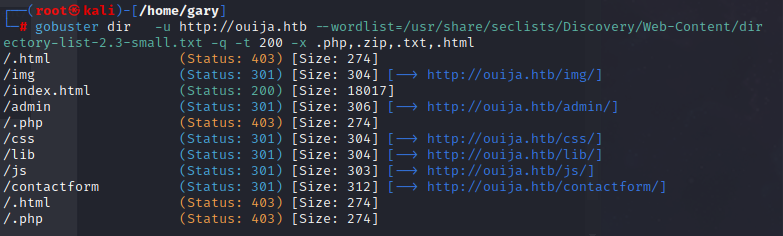
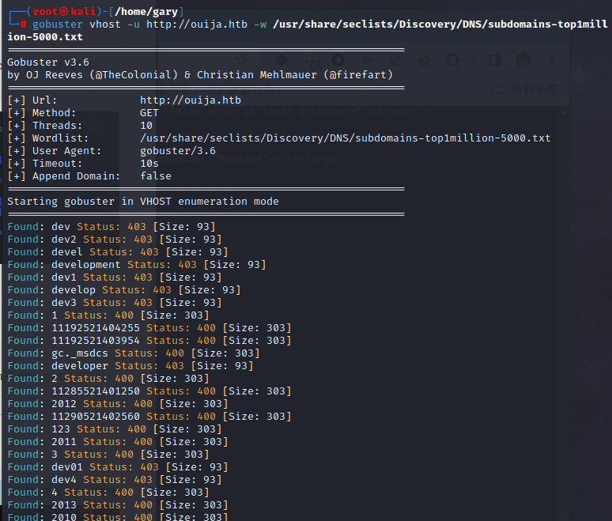
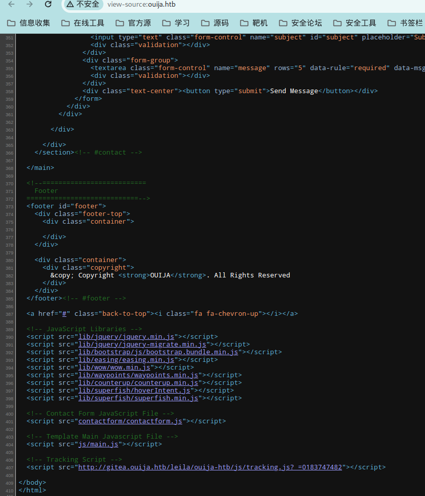

HTB | Ouija   放弃

使用nmap进行端口扫描

```
nmap -sV -sC -v -oN Ouija 10.10.11.244 
```

```
# Nmap 7.93 scan initiated Mon Jan  8 14:16:03 2024 as: nmap -sV -sC -v -oN Ouija 10.10.11.244
Nmap scan report for 10.10.11.244
Host is up (0.64s latency).
Not shown: 997 closed tcp ports (reset)
PORT     STATE SERVICE VERSION
22/tcp   open  ssh     OpenSSH 8.9p1 Ubuntu 3ubuntu0.4 (Ubuntu Linux; protocol 2.0)
| ssh-hostkey: 
|   256 6ff2b4ed1a918d6ec9105171d57c49bb (ECDSA)
|_  256 dfddbcdc570d98af0f882f73334862e8 (ED25519)
80/tcp   open  http    Apache httpd 2.4.52
| http-methods: 
|_  Supported Methods: POST OPTIONS HEAD GET
|_http-title: Apache2 Ubuntu Default Page: It works
3000/tcp open  http    Node.js Express framework
|_http-favicon: Unknown favicon MD5: 03684398EBF8D6CD258D44962AE50D1D
|_http-title: Site doesn't have a title (application/json; charset=utf-8).
| http-methods: 
|_  Supported Methods: GET HEAD POST OPTIONS
Service Info: Host: localhost; OS: Linux; CPE: cpe:/o:linux:linux_kernel

Read data files from: /usr/bin/../share/nmap
Service detection performed. Please report any incorrect results at https://nmap.org/submit/ .
# Nmap done at Mon Jan  8 14:16:47 2024 -- 1 IP address (1 host up) scanned in 44.53 seconds
```


使用gobuster进行目录扫描

```
gobuster dir   -u http://ouija.htb --wordlist=/usr/share/seclists/Discovery/Web-Content/directory-list-2.3-small.txt -q -t 200 -x .php,.zip,.txt,.html 
```




使用gobuster进行子域名扫描

```
gobuster vhost -u http://ouija.htb -w /usr/share/seclists/Discovery/DNS/subdomains-top1million-5000.txt
```



没啥用，在ouija源代码发现一个子域名：gitea，添加到hosts里面




访问子域名gitea发现搭建了一个gitea版本为：1.21.0

