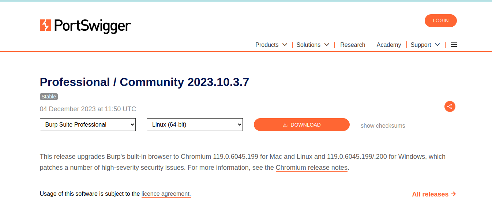
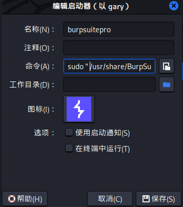

## kali安装最新BurpSuitePRO V2023.10.3 及google浏览器在linux下导burp证书

由于kali自带的是社区版，功能没有专业版强大。

注册机：https://github.com/h3110w0r1d-y/BurpLoaderKeygen/releases

burpsuitepro直接去官网地址下载：https://portswigger.net/burp/releases/professional-community-2023-10-3-7?requestededition=professional&requestedplatform=

jdk [jdk-17_linux-x64_bin.deb](https://download.oracle.com/java/17/latest/jdk-17_linux-x64_bin.deb)

#### java环境的安装

```
dpkg -i jdk-17_linux-x64_bin.deb
java -version
```

#### burpsuitepro的安装



下载好后将文件赋予执行权限并执行安装

```
sudo chmod +x burpsuite_pro_linux_v2023_10_3_4.sh
./burpsuite_pro_linux_v2023_10_3_4.sh
```

再将注册机jdk 放入burpsuite pro安装目录，使用命令打开jdk，使用root权限执行这条命令就不会出现注册码，直接就能使用。为了方便打开，我自己写了一个shell脚本，内容就是以下内容。

```
java -jar "/usr/share/BurpSuitePro/BurpLoaderKeygen_v1.17.jar"
```

再在桌面创造一个启动器，以sudo命令启动这个脚本就可以直接使用。各个环境不同，我设置了sudo不需要输入密码，我就设置了这样方式。



到这里就安装结束了，但是我使用的是google浏览器，不能直接导burp证书，经过了查询，直接用工具导证书。

先将burp证书下载下来在把后缀改为crt

```
sudo apt install libnss3-tools
mkdir -p ~/.pki/nssdb
certutil -d sql:$HOME/.pki/nssdb -A -t "C,," -n GoAgent -i cacert.crt
```

重新打开浏览器就可以正常抓包了，文档很简洁，需要有点基础。

注:*本文仅*作为*自己*的*学习*记录以备复习查阅，切勿使用burp非法操作
