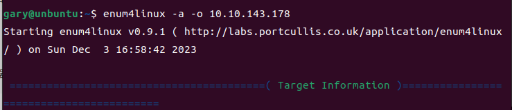

### gobuster-爆破子域名/目录

GitHub地址：https://github.com/OJ/gobuster

主要有这几种模式

dir - 经典的目录暴力破解模式
dns - DNS 子域暴力破解模式
s3 - 枚举打开的 S3 存储桶并查找存在和存储桶列表
vhost - 虚拟主机暴力破解模式（与 DNS 不同！）

```
gobuster dir -u https://10-10-147-21.p.thmlabs.com/ -w /usr/share/wordlists/dirbuster/directory-list-2.3-small.txt
```

#### 安装教程

下载go语言

安装包下载地址为：https://go.dev/dl/

将下载的二进制包解压至 /usr/local目录。

```
tar -C /usr/local -zxvf go1.21.4.linux-amd64.tar.gz
```

编辑 /etc/profile，并将以下命令添加该文件的末尾，这样就永久生效了：

```
export PATH=$PATH:/usr/local/go/bin
```

添加后需要执行：

```
source /etc/profile
```

下载gobuster 

[Go](https://golang.org/)环境至少是 go 1.19

```
go install github.com/OJ/gobuster/v3@latest
```

编辑 /etc/profile，并将以下命令添加该文件的末尾，这样就永久生效了：

```
export PATH=$PATH:~/go/bin
```

添加后需要执行：

```
source /etc/profile
```

查看gobuster版本

```
gobuster version
```


### pdfinfo-读取pdf源数据

```
apt install poppler-utils
```


### exiftool-从图像中读取EXIF数据

```
apt install libimage-exiftool-perl
```


### enum4linux-ng

安装

```
snap install enum4linux
```

使用

```
enum4linux -a -o 10.10.143.178
```



找到用户信息：kay，jan

