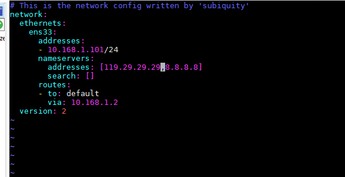

##### pip安装报错root权限

WARNING: Running pip as the ‘root‘ user can result in broken permissions and conflicting


创建一个虚拟环境

```
python3 -m venv tutorlal-env
apt install python3.11-venv
python3 -m venv tutorial-env
source tutorial-env/bin/activate
```

##### ubuntu添加dns服务器重启后文件失效

```
 vim /etc/netplan/00-installer-config.yaml
```



重启网卡

```
 netplan apply
```

